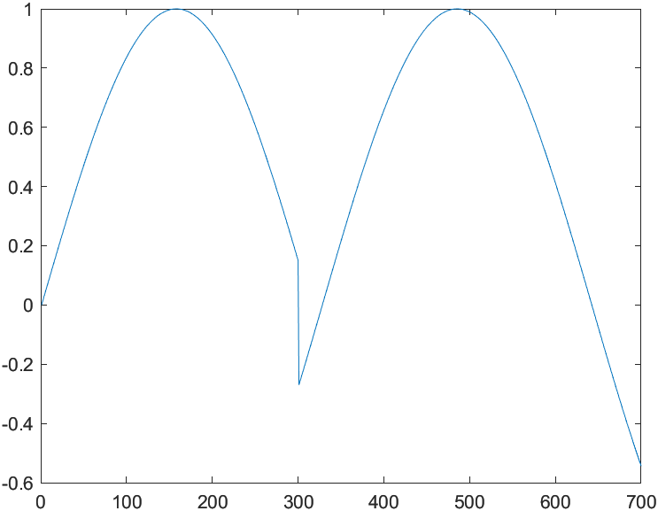

# Matlab Language

- [Matlab Language](#matlab-language)
  - [Grammar Introduction](#grammar-introduction)
  - [Data Type](#data-type)
  - [Variables](#variables)
  - [Operator](#operator)
  - [Expression & Sentence](#expression--sentence)
  - [Language Control](#language-control)
    - [`if` statement](#if-statement)
    - [`switch` statement: no need 'break'](#switch-statement-no-need-break)
    - [`try` Statement](#try-statement)
    - [loop Statement](#loop-statement)
    - [recursive](#recursive)
  - [function](#function)
    - [function in & out](#function-in--out)

## Grammar Introduction

> 各种计算机语言，基本语法的框架都比较一致，都包括数据类型、常变量定义、运算符种类、表达式定义、程序流程控制、函数定义、程序文件编写等几个方面。不同的语言，语法具体细节在规定上有所不同。

基本语法:
- 数据类型
- 常量与变量
- 运算符
- 表达式
- 语句
- 流程控制
- script file & function file

## Data Type

[MATLAB DataType](https://www.mathworks.com/help/matlab/data-types.html):
- Numeric: integer; single, double; 
- Logical
- character & string
- array & matrix
- date & time
- structures
- cell
- function handles
- java type

```matlab
% numeric type
a0=int8(123) % 123
a1=int16(123) % 123
a2=int32(123) % 123
a3=int64(123) % 123

b0=int8(256) % 127
b1=int8(-256) % -128
b2=int16(256) % 256
b3=int16(-256) % -256
```

```matlab
% logical type
a=logical(0) % false
b=logical(1) % true

a&b % false
a|b % true
~a % true
a>b % false
a<b % true
```

```matlab
% character & string type
a0='hello'
a1='1'
a2='1.23'
a3=a1+a2 % [98 95 99 100]
a4=[a1, a2] % '11.23'
a5=char(65) % 'A'
a6=char([97, 98]) % 'ab'
```

```matlab
% array & matrix type
a0=[1, 2, 3] % 结果出现在command window
a1=[4, 5, 6]; % 不会出现在command window
a2=[1, 2, 3; 4, 5, 6]
```

```matlab
% date & time
clock

% output
ans = 1×6
    2019	5	1	11	56	45.8180000000000
```

```matlab
% struct: 结构体myStruct.memberName=expression
a.x1=pi;
a.x2='string';
a.x3=1:10

%结构体操作
isstruct(a)
fieldnames(a)
isfield(a,'x2')
b=getfield(a,'x3')
c=rmfield(a,'x1')

% output
a = 
    x1: 3.1416
    x2: 'string'
    x3: [1 2 3 4 5 6 7 8 9 10]

ans = 
   1

ans = 
    {'x1'}
    {'x2'}
    {'x3'}

ans = 
   1

b = 1×10    
     1     2     3     4     5     6     7     8     9    10

c = 
    x2: 'string'
    x3: [1 2 3 4 5 6 7 8 9 10]
```

```matlab
% cell
a={12,pi,'string',1:4}

% output
a = 
    {[12]}    {[3.1416]}    {'string'}    {1×4 double}
```

```matlab
% function handles
c1='cos'
fh1=str2func(c1)

fh2=@sin
c2=func2str(fh2)

feval(fh1, pi)

functions(fh1)

% output
c1 = 'cos'
fh1 = 
    @cos

fh2 = 
    @sin

c2 = 'sin'
ans = -1
ans = 
    function: 'cos'
        type: 'simple'
        file: ''
```

```matlab
% datatype convert
db=pi;
class(db)
class(ans)
num=int32(db)
str='I am genius'
ch='a'
d=double(ch)
e=char(100)
eval('t=333')
f=str2num('365')
g=num2str(123456789)
whos

%output
ans = 'double'
ans = 'char'
num = 3
str = 'I am genius'
ch = 'a'
d = 97
e = 'd'
t = 333
f = 365
g = '123456789'
  Name      Size            Bytes  Class     Attributes

  ans       1x4                 8  char
  ch        1x1                 2  char
  d         1x1                 8  double
  db        1x1                 8  double
  e         1x1                 2  char
  f         1x1                 8  double
  g         1x9                18  char
  num       1x1                 4  int32
  str       1x11               22  char
  t         1x1                 8  double
```

## Variables

> matlab关于变量的语法：变量使用前不需要定义，但变量使用前必须赋值，程序执行过程中，变量的值、类型都可以改变。  
> C, java等语言关于变量的语法：变量使用前必须先定义，变量使用前应该先赋值，程序执行过程中，变量的值可以改变，但类型不能改变。

- 字母开头; 包括字母、数字、下划线; 区分大小写; 长度限制为63
- 不声明，不定义，拿来即用; 动态类型

```matlab
% 动态类型
a=12.5 % double
a='hello' % char
```

Matlab查看变量:
- workspace窗口显示
- 命令方式: `who`, `whos` in command window
- "MATLAT Live Editor"

```matlab
%type in "MATLAT Live Editor"
a=1;b=2;c=3;d=4;
who
% Your variables are:
%   a b c d
whos
%  Name      Size            Bytes  Class     Attributes
%
%  a         1x1                 8  double
%  b         1x1                 8  double
%  c         1x1                 8  double
%  d         1x1                 8  double
clear a; % 清除变量
```

Other commands:
- 查看帮助 `help clear`, `help cos`, ...
- 清除所有变量： `clear;`
- 清除command window: `clc;`
- 保存、导入variables(默认为二进制文件):`save`, `load`

```matlab
a=1;b=2;c=3;d=4;
save('myVariables','a','b')

%变量被存放工作目录下的myVariables.mat中，然后添加e
e=5;
save('myVariables.mat','e','-append');

%load a
clear;
load('myVariables.mat','a');
whos

% output
  Name      Size            Bytes  Class     Attributes

  a         1x1                 8  double
```

```matlab
% matlab的常量能够被覆盖
pi % 3.1415926
pi=8
pi % 8
```

## Operator

[MATLAB Operators](https://www.mathworks.com/help/matlab/matlab_prog/matlab-operators-and-special-characters.html)

```matlab
% import example
A=[1 2;3 4];
B=[1 3;2 4];
C=A>B % [0, 0; 1, 0]

a = [1 2 0 3 4 2 0];
b = [0 2 3 5 4 0 0];
c = a & b % [0, 1, 0, 1, 1, 0, 0]
```

```matlab
% 数值的左除、右除
a1=10/2 % 5
a2=10\2 % 0.2000
a3=10./2 % 5
a4=10.\2 % 0.2000

% 矩阵的左点除、右点除
b1=[2, 4, 6; 6, 9, 12];
b2=[2, 2, 2; 3, 3, 3];
b1./b2 % [1, 2, 3; 2, 3, 4]
b1.\b2 % [1.0000, 0.5000, 0.3333; 0.5000, 0.3333, 0.2500]

% 矩阵的左除、右除
% Ax=B, 并且A可逆, x=inv(A)*B
% xA=D, 并且A可逆, x=D*inv(A)
A=[1, 2; 3, 4];
x=[2, 3; 4, 5];
B=A*x % [10, 13; 22, 29]
inv(A)*B
A\B % [2, 3; 4, 5]

D=x*A % [11, 16; 19, 28]
D*inv(A)
D/A % [2, 3, 4, 5]
```

## Expression & Sentence

- 回车则表示一句结束
  - 末尾无分号，则输出该句执行该结果
  - 末尾有分号，只执行，不输出
- 注释以`%`开头表示
- 一行写不开，用`…`续行，否则默认这一句已经完毕

赋值：
- 变量=表达式:将表达式的值赋值给=前的变量
- 表达式:将表达式的值赋值给默认变量ans

## Language Control

顺序，循环，选择

M-file:
- Script File: no input, no return,可以对workspace的variables进行操作，结果返回workspace，可以直接运行
- Function File: 变量为局部变量，函数执行完毕，变量被清除，要通过调用的形式运行（特殊函数除外，比如GUI的function）

```matlab
% input
% in command window
>> a=input('please input a number:')
please input a number:666

% output
a =
   666
```

```matlab
% disp: 显示比较紧凑
% in command window
>> A=input('please enter a number: ')
disp('I am Genius')
disp(A)
please enter a number: 10

% output
A =
    10

I am Genius
    10

% pause经常用于动画
>> pause(3);A
A =
    10

>> pause(3);disp(A)
    10
```

### `if` statement

```matlab
A=input('please enter a number: ')
if(A<5)
    %disp即便是有;也会输出
    disp(A);
elseif(A<10)
    disp('A is bigger than 5 and smaller than 10');
else
    disp('A is bigger than 10');
end

% output
A = 456789
A is bigger than 10
```

```matlab
x=0:0.01:10;
%过滤掉3<x<6部分
y=sin(x(x<3 | x>6));
plot(y)
```

> 

### `switch` statement: no need 'break'

```matlab
price=input('enter the price: ')
switch fix(price/100)
    case {0,1}
        rate=0;
    case 2
        rate=0.1;
    case 3
        rate=0.15
    case {4,5,6}
        rate=0.5;
    otherwise
        rate=0.6;
end
disp(['the rate is ',num2str(rate)]);

% output
price = 564
the rate is 0.5
```

### `try` Statement

Try statement: 如果有错误，不执行这个语句，执行catch语句或者直接结束try语句体

### loop Statement

循环可以嵌套，**但是在MATLAB中，循环的执行效率很低（因为是解释型语言）**

因此应该尽量避免使用循环，更要避免使用两重以上的循环
> 根据自己的使用经验，三重循环执行起来就已经非常慢了

怎样避免使用循环和提高循环效率？
- 有些可以通过MATLAB的矢量化语言，通过矩阵或者向量操作完成；
- 有些可以通过MATLAB提供的一些特殊操作工具箱函数完成；
- Matlab预分配内存，会大大增加循环效率；

```matlab
% for loop
A=1:1000;
sum=0;
%不要使用i,j;因为和复数冲突，使用k,m
for k=1:2:100
    sum=sum+A(k);
end
sum
% output
sum = 2500
```

```matlab
% while loop
while 1
    %'s'表示字符
    ch=input('enter a character:','s');
    if isempty(ch)
        break;
    end
end
```

### recursive

example: 直接递归, 求阶乘

```matlab
% my_factorial.m
function res=my_factorial(n)
    if n <=1
        res=1;
    else
        res=my_factorial(n-1)*n;
    end
end

% in command window:
% my_factorial(5)
% ans =
%       120
```

example: 间接递归

$$
f\left( n \right) =\left\{ \begin{array}{l}
	\sin \left[ \pi \frac{f\left( n-2 \right)}{f\left( n-2 \right)} \right] ,\ n\ is\ even\\
	\cos \left[ \pi \frac{f\left( n-2 \right)}{f\left( n-1 \right)} \right] ,\ n\ is\ odd\\
\end{array} \right. 
$$

```matlab
% func1.m
function res=func1(n)
    if n<=0 || mod(n,2)~=0
        error('只处理大于0的偶数');
    elseif n<=2
        res=1;
    else
        a=func1(n-2);
        b=func2(n-1);
        res=sin(pi*(a/b));
    end
    disp([n,res]);
end
```

```matlab
% func2.m
function res=func2(n)
    if n<=0 || mod(n,2)==0
        error('只处理大于0的奇数');
    elseif n<=1
        res=1;
    else
        a=func2(n-2);
        b=func1(n-1);
        res=cos(pi*(a/b));
    end
    disp([n,res]);
end
```

## function

Syntax:
- `function [output args] = function_name([input args])`
- `%`注释说明，用于help,lookfor的查询结果，标准格式参照MATLAB自带的函数
- 函数体

> 除非是在其他函数里面定义的，否则function前面只能有注释内容，其他不能有；  
> 通常函数名与文件名相同，两者不同时以文件名为准

function in live editor:
```matlab
x = 1:10;
n = length(x);
avg = mymean(x,n)

function a = mymean(v,n)
    % MYMEAN Example of a local function.
    a = sum(v)/n;
end

% output
avg = 5.5000
```

function in m-file:
```matlab
function mysum=myAdd(num1, num2)
    % add two number
    mysum=num1+num2
end
```

```matlab
% in command window
>> help mysum
    add two number
>> mysum(12, 56)
ans = 
        68
```

### function in & out
- nargin: number of function input arguments;
- nargout
- varargin
- varargout: variable length input argument list
- 可以完成传递参数的可调功能，类似高级语言的函数重载和多态

example: nargin example in Live Editor

```matlab
myMultiAdd(1,2,3, 4)
myMultiAdd(999)

%=================================
function sum=myMultiAdd(num1,num2,num3,num4)
    %this is a multiadd function
    if nargin==4
        sum=num1+num2+num3+num4;
    elseif nargin==3
        sum=num1+num2+num3;
    elseif nargin==2
        sum=num1+num2;
    else
        error('the nargin between 2 and 4')
    end
end

% output
ans = 10

Error using Untitled2>myMultiAdd (line 13)
the nargin between 2 and 4
```

example: nargout example in live Editor

```matlab
x1=my_mu(1,2,3,4)
[x2,y2]=my_mu(1,2,3,4)

%===========================
function [a,b]=my_mu(num1,num2,num3,num4)
    if nargout==2
        a=num1+num2+num3+num4;
        b=num1*num2*num3*num4;
    else
        a=num1+num2+num3+num4;
    end
end

% output
x1 = 10
x2 = 10
y2 = 24
```

example: varargin example in Live Editor

```matlab
x1=add_var(1,2)
x2=add_var(1,2,3)
x3=add_var(1,2,3,4)
x4=add_var(1,2,3,4,5)

%===========================
function re=add_var(a,b,varargin)
    %检测输入参数个数，不在该范围，给出错误信息
    narginchk(2,4);

    if nargin==2
        re=a+b;
    elseif nargin==3
        %varargin中的数据为cell类型
        c=varargin{1};
        re=a+b+c;
    elseif nargin==4
        c=varargin{1};
        d=varargin{2};
        re=a+b+c+d;
    else
        error('wrong');
    end
end

% output
x1 = 3
x2 = 6
x3 = 10

Error using Untitled2>add_var (line 8)
Too many input arguments.
```

example: varargout
> 参考函数`pburg`的写法: `edit pburg`

```matlab
x1=myFun_varout(1,2)
[x2,y2]=myFun_varout(1,2)
[x3,y3]=myFun_varout(1,2,4)
myFun_varout(1,2,4)

%==========================
function varargout=myFun_varout(a,b,varargin)
    narginchk(2,4);

    if nargin==2
        varargout{1}=a+b;
        varargout{2}=a*b;
    elseif nargin==3
        c=varargin{1};
        varargout{1}=a+b+c;
        varargout{2}=a*b*c;
    else
        error('wrong');
    end
end

% output
x1 = 3
x2 = 3
y2 = 2
x3 = 7
y3 = 8
ans = 7
```

