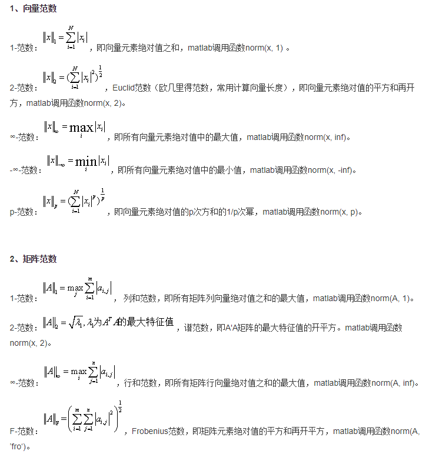

# Matrix

- [Matrix](#matrix)
  - [Generate Matrix](#generate-matrix)
  - [Matrix Reference](#matrix-reference)
  - [Special matrix](#special-matrix)
  - [Matrix Product](#matrix-product)
    - [inner product](#inner-product)
    - [outer product](#outer-product)
    - [tensor product](#tensor-product)
  - [conv](#conv)
  - [Matrix function](#matrix-function)
  - [Function Matrix](#function-matrix)
  - [other operations](#other-operations)
  - [Matrix Modification](#matrix-modification)
  - [Eigenvalues λ](#eigenvalues-%CE%BB)
  - [Jordan normal form](#jordan-normal-form)
  - [System of linear equations](#system-of-linear-equations)
  - [norm](#norm)

## Generate Matrix

```matlab
% method1:by typing
A0=[1, 3, 5, 7]
% method2: init:step:end, [init, ..., end]
A1=1:2:7
A2=1:7
% method3: linspace, logspace
x1=linspace(1, 7, 4)
x2=logspace(2, 4, 3)
x3=logspace(1,pi,4) % very special

% output
A0 = 1×4    
     1     3     5     7

A1 = 1×4    
     1     3     5     7

A2 = 1×7    
     1     2     3     4     5     6     7

x1 = 1×4    
     1     3     5     7

x2 = 1×3    
         100        1000       10000

x3 = 1×4    
   10.0000    6.7980    4.6213    3.1416
```

## Matrix Reference

```matlab
% 1d
x=1:5
x(2)
x(2:4)
% 2d
A=reshape(1:20, 4, 5)
A(2:3,3:4)
A(2:3,:)
A(2,:)
A(2,3)
% 引用n维矩阵中的一个元素，需要n个角标

% output
x = 1×5    
     1     2     3     4     5

ans = 2
ans = 1×3    
     2     3     4

A = 4×5    
     1     5     9    13    17
     2     6    10    14    18
     3     7    11    15    19
     4     8    12    16    20

ans = 2×2    
    10    14
    11    15

ans = 2×5    
     2     6    10    14    18
     3     7    11    15    19

ans = 1×5    
     2     6    10    14    18

ans = 4×1    
     9
    10
    11
    12

ans = 10
```

```matlab
% generate 3d matrix
for i=1:2
    for j=1:3
        for k=1:4
            c(i, j, k)=i*j*k
        end
    end
end
```

## Special matrix

```matlab
A=eye(3,4)
B=eye(3)
C=ones
D=zeros(4)
E=rand(3)
F=randn(3)
G=magic(5)

a=randn(1, 5)
b=rand(5, 1)
hist(a) % draw histogram for a
hist(b)  % draw histogram for b

%5-10 random matrix[rand()为0-1]
H=5+(10-5)*rand(3)
%μ=10,σ=4正态分布矩阵[randn()为μ=0,σ=1正态分布矩阵]
I=10+sqrt(4)*randn(3)

meanI1=mean(I)
meanI2=mean(mean(I))
stdI1=std(I)
stdI2=std(std(I))
%标准用法
meanAll=mean(I(:))
stdAll=std(I(:))

%output=============================
A = 
     1     0     0     0
     0     1     0     0
     0     0     1     0

B = 
     1     0     0
     0     1     0
     0     0     1

C = 1
D = 
     0     0     0     0
     0     0     0     0
     0     0     0     0
     0     0     0     0

E = 
    0.3377    0.1112    0.2417
    0.9001    0.7803    0.4039
    0.3692    0.3897    0.0965

F = 
   -1.1201    0.3075   -0.1765
    2.5260   -1.2571    0.7914
    1.6555   -0.8655   -1.3320

G = 
    17    24     1     8    15
    23     5     7    14    16
     4     6    13    20    22
    10    12    19    21     3
    11    18    25     2     9

a = 
   -2.3299   -1.4491    0.3335    0.3914    0.4517

H = 
    7.2546    8.7235    5.9176
    7.7350    5.9448    6.8424
    6.4816    8.4339    8.1281

I = 
   12.0782   11.3203    9.5648
    7.7647    9.8643    9.3938
   12.5213    9.6096   10.0461

meanI1 = 
   10.7881   10.2647    9.6682

meanI2 = 10.2403
stdI1 = 
    2.6277    0.9230    0.3382

stdI2 = 1.1895
meanAll = 10.2403
stdAll = 1.4843
```

计算机产生的随机数不是真正的随机数。实际上，当调用随机函数的时候，计算机使用默认的数值，根据固定算法，产生一个数列，每次调用随机函数，都是依次从数列中取若干个值，第一次如果取m个值，下次再要取n个值的时候，是从第m＋1个值开始向后取的。
> 同时打开两个matlab窗口，分别在两个窗口中调用相同的取随机数的指令，会发现两个窗口中取出的随机数相同。  
> 两次打开matlab窗口，取随机数，也可以看到类似结果。  

```matlab
rng(sum(clock)) % 时间作为seed
a = randn()
```

```matlab
% Triangular
A=rand(4)
d0=diag(A)
d11=diag(A, 1)
d12=diag(A, -1)
d21=diag(A, 2)

t0=tril(A)
t11=tril(A, 1)
tu0=triu(A)
tu11=triu(A, 1)

B=[1, 2, 3]
C0=diag(B)
C1=diag(B, 1)

% output
A = 4×4    
    0.6020    0.7482    0.9133    0.9961
    0.2630    0.4505    0.1524    0.0782
    0.6541    0.0838    0.8258    0.4427
    0.6892    0.2290    0.5383    0.1067

d0 = 4×1    
    0.6020
    0.4505
    0.8258
    0.1067

d11 = 3×1    
    0.7482
    0.1524
    0.4427

d12 = 3×1    
    0.2630
    0.0838
    0.5383

d21 = 2×1    
    0.9133
    0.0782

t0 = 4×4    
    0.6020         0         0         0
    0.2630    0.4505         0         0
    0.6541    0.0838    0.8258         0
    0.6892    0.2290    0.5383    0.1067

t11 = 4×4    
    0.6020    0.7482         0         0
    0.2630    0.4505    0.1524         0
    0.6541    0.0838    0.8258    0.4427
    0.6892    0.2290    0.5383    0.1067

tu0 = 4×4    
    0.6020    0.7482    0.9133    0.9961
         0    0.4505    0.1524    0.0782
         0         0    0.8258    0.4427
         0         0         0    0.1067

tu11 = 4×4    
         0    0.7482    0.9133    0.9961
         0         0    0.1524    0.0782
         0         0         0    0.4427
         0         0         0         0

B = 1×3    
     1     2     3

C0 = 3×3    
     1     0     0
     0     2     0
     0     0     3

C1 = 4×4    
     0     1     0     0
     0     0     2     0
     0     0     0     3
     0     0     0     0
```

```matlab
% Hilbert & Toeplitz
format short;
% Hilbert matrix
A=hilb(4)
format rat
A
B=invhilb(4) % same as: inv(A)

% toeplitz(c, r)
% 将c作为第一列，将r作为第一行，其余元素与左上角相邻元素相等
T0=toeplitz(1:4, 1:2:5)
T1=toeplitz(1:3)

% output
A = 4×4    
    1.0000    0.5000    0.3333    0.2500
    0.5000    0.3333    0.2500    0.2000
    0.3333    0.2500    0.2000    0.1667
    0.2500    0.2000    0.1667    0.1429

A = 4×4    
       1              1/2            1/3            1/4     
       1/2            1/3            1/4            1/5     
       1/3            1/4            1/5            1/6     
       1/4            1/5            1/6            1/7     

B = 4×4    
      16           -120            240           -140       
    -120           1200          -2700           1680       
     240          -2700           6480          -4200       
    -140           1680          -4200           2800       

T0 = 4×3    
       1              3              5       
       2              1              3       
       3              2              1       
       4              3              2       

T1 = 3×3    
       1              2              3       
       2              1              2       
       3              2              1       
```

## Matrix Product

### inner product

$$
\vec{x}=\left(\begin{matrix}x_1\\\ldots\\x_n\\\end{matrix}\right),\vec{y}=\left(\begin{matrix}y_1\\\ldots\\y_n\\\end{matrix}\right)\\
\left< \vec{x},\vec{y} \right>=\vec{x}^H\vec{y}=\sum_{i=1}^n{x_{i}^{*}y_i}\\
\left< \vec{y},\vec{x} \right> =\vec{y}^H\vec{x}=\sum_{i=1}^n{y_{i}^{*}x_i}=\left< \vec{x},\vec{y} \right>^*\\
$$

```matlab
x=[1+1i; 2+1i]
x.'
x'

y=[1+3i; 3+1i]
% <x,y>
dot(x, y)
x'*y
sum(conj(x).*y)

% <y,x>
dot(y, x)
x.'*conj(y)

% output
x = 2×1 complex    
   1.0000 + 1.0000i
   2.0000 + 1.0000i

ans = 1×2 complex    
   1.0000 + 1.0000i   2.0000 + 1.0000i

ans = 1×2 complex    
   1.0000 - 1.0000i   2.0000 - 1.0000i

y = 2×1 complex    
   1.0000 + 3.0000i
   3.0000 + 1.0000i

ans = 11.0000 + 1.0000i
ans = 11.0000 + 1.0000i
ans = 11.0000 + 1.0000i
ans = 11.0000 - 1.0000i
ans = 11.0000 - 1.0000i
```

```matlab
x1=1:3
x2=2:4
dot(x1, x2, 1) % 按列加和
dot(x1, x2, 2) % 按行加和
dot(x1, x2, 3) % 不加和
dot(x1, x2) % 按行加和

A1=reshape(1:6, 2, 3)
A2=reshape(2:7, 2, 3)
dot(A1, A2, 1)
dot(A1, A2, 2)
dot(A1, A2, 3)
dot(A1, A2)

% output
x1 = 1×3    
     1     2     3

x2 = 1×3    
     2     3     4

ans = 1×3    
     2     6    12

ans = 20
ans = 1×3    
     2     6    12

ans = 20
A1 = 2×3    
     1     3     5
     2     4     6

A2 = 2×3    
     2     4     6
     3     5     7

ans = 1×3    
     8    32    72

ans = 2×1    
    44
    68

ans = 2×3    
     2    12    30
     6    20    42

ans = 1×3    
     8    32    72
```

### outer product

```matlab
% 向量a，b的叉积。要求a，b为3*n或n*3的矩阵
% x1 × x2
x1=[1, 2, 3]
x2=[2, 3, 4]
cross(x1, x2)
% x3·(x1 × x2)
x3=[1, 1, 1]
dot(x3, cross(x1, x2))

A1=reshape(1:6, 3, 2)'
A2=reshape(2:7, 3, 2)'
cross(A1, A2)
% not exist cross(A1, A2, 1), cross(A1, A2, 3)
cross(A1, A2, 2)

% output
x1 = 1×3    
     1     2     3

x2 = 1×3    
     2     3     4

ans = 1×3    
    -1     2    -1

x3 = 1×3    
     1     1     1

ans = 0
A1 = 2×3    
     1     2     3
     4     5     6

A2 = 2×3    
     2     3     4
     5     6     7

ans = 2×3    
    -1     2    -1
    -1     2    -1

ans = 2×3    
    -1     2    -1
    -1     2    -1
```

### tensor product

$$
C=A\otimes B=\left( \begin{matrix}
	a_{11}B&		...&		a_{1n}B\\
	...&		...&		...\\
	a_{m1}B&		...&		a_{mn}B\\
\end{matrix} \right) 
$$

```matlab
% 张量积
A=eye(2)
B=[1,-1;-1,1]
kron(A, B)

% output
A = 2×2    
     1     0
     0     1

B = 2×2    
     1    -1
    -1     1

ans = 4×4    
     1    -1     0     0
    -1     1     0     0
     0     0     1    -1
     0     0    -1     1
```

## conv

```matlab
% 多项式展开(s^2+2s+2)(s+4)(s+1)
w=conv([1,2,2],conv([1,4], [1,1])) % 1 7 16 18 8
p=poly2str(w, 's') % s^4+7s^3+16s^2+18s+8

% 求多项式(x^3+2x^2+3x+4)(10x^2+20x+30)的卷积，并用卷积除以多项式(x^3+2x^2+3x+4)
% [q,r]=deconv(u,v) % q:商多项式;r:余多项式
u=[1,2,3,4]
v=[10,20,30]
c=conv(u, v)
[q,r]=deconv(c,u)

% output
u = 1×4    
     1     2     3     4

v = 1×3    
    10    20    30

c = 1×6    
    10    40   100   160   170   120

q = 1×3    
    10    20    30

r = 1×6    
     0     0     0     0     0     0
```

## Matrix function

```matlab
A=eye(3)
B=expm(A)
logm(B)

y=[1,2;3,4]
x=sqrtm(y)
x*x

% output
A = 3×3    
     1     0     0
     0     1     0
     0     0     1

B = 3×3    
    2.7183         0         0
         0    2.7183         0
         0         0    2.7183

ans = 3×3    
     1     0     0
     0     1     0
     0     0     1

y = 2×2    
     1     2
     3     4

x = 2×2 complex    
   0.5537 + 0.4644i   0.8070 - 0.2124i
   1.2104 - 0.3186i   1.7641 + 0.1458i

ans = 2×2 complex    
   1.0000 + 0.0000i   2.0000 - 0.0000i
   3.0000 - 0.0000i   4.0000 + 0.0000i
```

```matlab
A=[1,0;1,1]
B1=expm(A)
B2=funm(A, @exp) % 矩阵操作
B3=exp(A) % 对每一个元素操作，与上面不同

C2=funm(A, @sin)
c3=sin(A)

% output
A = 2×2    
     1     0
     1     1

B1 = 2×2    
    2.7183         0
    2.7183    2.7183

B2 = 2×2    
    2.7183         0
    2.7183    2.7183

B3 = 2×2    
    2.7183    1.0000
    2.7183    2.7183

C2 = 2×2    
    0.8415         0
    0.5403    0.8415

c3 = 2×2    
    0.8415         0
    0.8415    0.8415
```

## Function Matrix

```matlab
%其中的syms表示要用到符号运算
syms x;
A=[sin(x),exp(x),1;cos(x),x^2+1,log(x)]
diff(A)
diff(A,2)

%output============================
A =
[ sin(x),  exp(x),      1]
[ cos(x), x^2 + 1, log(x)]

ans =
[  cos(x), exp(x),   0]
[ -sin(x),    2*x, 1/x]

ans =
[ -sin(x), exp(x),      0]
[ -cos(x),      2, -1/x^2]
```

## other operations

```matlab
A=2*eye(3)
B=[1,2;2,4]
% det=0, cannot inverse
det(A)
det(B)

inv(A)
trace(A)
rank(A)

% output
A = 3×3    
     2     0     0
     0     2     0
     0     0     2

B = 2×2    
     1     2
     2     4

ans = 8
ans = 0
ans = 3×3    
    0.5000         0         0
         0    0.5000         0
         0         0    0.5000

ans = 6
ans = 3
```

## Matrix Modification

```matlab
% expand
A=1:4
B=eye(2)
C=zeros(2)
D=[A;B C]

% delete column
D(:,2)=[]

% modify row
D(2,:)=[11,22,33]
D(2,2)=222

% output
A = 1×4    
     1     2     3     4

B = 2×2    
     1     0
     0     1

C = 2×2    
     0     0
     0     0

D = 3×4    
     1     2     3     4
     1     0     0     0
     0     1     0     0

D = 3×3    
     1     3     4
     1     0     0
     0     0     0

D = 3×3    
     1     3     4
    11    22    33
     0     0     0

D = 3×3    
     1     3     4
    11   222    33
     0     0     0
```

```matlab
A=reshape(1:6, 2, 3)
flipud(A)
flip(A, 1)
fliplr(A)
flip(A, 2)
rot90(A)

% output
A = 2×3    
     1     3     5
     2     4     6

ans = 2×3    
     2     4     6
     1     3     5

ans = 2×3    
     2     4     6
     1     3     5

ans = 2×3    
     5     3     1
     6     4     2

ans = 2×3    
     5     3     1
     6     4     2

ans = 3×2    
     5     6
     3     4
     1     2
```

```matlab
A=eye(2)
repmat(A, 2, 3)

B=reshape(1:6, 2, 3)
C=B(:)
D=ones(3, 2)
D(:)=B(:)
E=reshape(B, 3, 2)

% output
A = 2×2    
     1     0
     0     1

ans = 4×6    
     1     0     1     0     1     0
     0     1     0     1     0     1
     1     0     1     0     1     0
     0     1     0     1     0     1

B = 2×3    
     1     3     5
     2     4     6

C = 6×1    
     1
     2
     3
     4
     5
     6

D = 3×2    
     1     1
     1     1
     1     1

D = 3×2    
     1     4
     2     5
     3     6

E = 3×2    
     1     4
     2     5
     3     6
```

## Eigenvalues λ

> Ax=λx中，λ为特征值；x为特征向量

```matlab
A=[1,0,1i;0,2,0;-1i,0,1]
B=eig(A)
%V为特征向量，D为特征值
[V,D]=eig(A)

% output
A = 3×3 complex    
   1.0000 + 0.0000i   0.0000 + 0.0000i   0.0000 + 1.0000i
   0.0000 + 0.0000i   2.0000 + 0.0000i   0.0000 + 0.0000i
   0.0000 - 1.0000i   0.0000 + 0.0000i   1.0000 + 0.0000i

B = 3×1    
     0
     2
     2

V = 3×3 complex    
   0.0000 + 0.7071i   0.0000 + 0.7071i   0.0000 + 0.0000i
   0.0000 + 0.0000i   0.0000 + 0.0000i   0.0000 + 1.0000i
  -0.7071 + 0.0000i   0.7071 + 0.0000i   0.0000 + 0.0000i

D = 3×3    
     0     0     0
     0     2     0
     0     0     2
```


## Jordan normal form

```matlab
A=[-1,-2,6;-1,0,3;-1,-1,4]
[V,J]=jordan(A) %V为相似变换矩阵
M=V\A*V
isequal(J, M)

% output
A = 3×3    
    -1    -2     6
    -1     0     3
    -1    -1     4

V = 3×3    
    -2     1     3
    -1     0     0
    -1     0     1

J = 3×3    
     1     1     0
     0     1     0
     0     0     1

M = 3×3    
     1     1     0
     0     1     0
     0     0     1

ans = 
   1
```

## System of linear equations

$$
Ax=b;\\
A=\begin{bmatrix}
1&2&3\\
1&4&9\\
1&8&27
\end{bmatrix},
b=\begin{bmatrix}
5\\-2\\6
\end{bmatrix}
$$

> rank(A)=n, x=A\b  
> rank(A)<n, 无穷多解(齐次通解+特解)

```matlab
% rank(A)=n, b不等于0
A=[1,2,3;1,4,9;1,8,27]
b=[5;-2;6]

x=inv(A)*b %inv()is slower than \
y=A\b

%output
A = 
     1     2     3
     1     4     9
     1     8    27

b = 
     5
    -2
     6

x = 
   23.0000
  -14.5000
    3.6667

y = 
   23.0000
  -14.5000
    3.6667
```

```matlab
% rank(A)=n, b等于0
A=[1,2,3;1,4,9;1,8,27]
b=[0;0;0]
x=A\b

% output
x = 3×1    
     0
     0
     0
```

```matlab
% rank(A)<n, b不等于0
format rat
A=[1,1,-1,-1;2,-5,3,2;7,-7,3,1]
b=[5;-4;7];
rank(A)

y0=A\b %特解
y=null(A,'r') %两个向量
% 最终通解: y0+k1*y(:,1)+k2*y(:,2)

A = 3×4    
       1              1             -1             -1       
       2             -5              3              2       
       7             -7              3              1       

ans = 
       2       

y = 4×2    
       2/7            3/7     
       5/7            4/7     
       1              0       
       0              1       

y0 = 4×1    
       3       
       2       
       0       
       0       
```

最终通解:

$$
x=\left( \begin{array}{c}
	3\\
	2\\
	0\\
	0\\
\end{array} \right) +k_1\left( \begin{array}{c}
	2/7\\
	5/7\\
	1\\
	0\\
\end{array} \right) +k_2\left( \begin{array}{c}
	3/7\\
	4/7\\
	0\\
	1\\
\end{array} \right) 
$$

```matlab
format rat
A=[1,1,-1,-1;2,-5,3,2;7,-7,3,1];
b=[5;-4;7];
% 初等行变换将增广矩阵 [A,b] 化成最简行阶梯形
T=rref([A,b])

% output
T = 3×5    
       1              0             -2/7           -3/7            3       
       0              1             -5/7           -4/7            2       
       0              0              0              0              0       
```

最终通解:

$$
x=\left( \begin{array}{c}
	3\\
	2\\
	0\\
	0\\
\end{array} \right) +k_1\left( \begin{array}{c}
	2/7\\
	5/7\\
	1\\
	0\\
\end{array} \right) +k_2\left( \begin{array}{c}
	3/7\\
	4/7\\
	0\\
	1\\
\end{array} \right) 
$$

## norm

范数：表示距离。包括1范数，2范数，无穷范数，f范数，都是使用norm函数
> 

```matlab
%norm for vector
A=1:4;
B1=norm(A,1)
B2=norm(A,2)
B3=norm(A,inf)
B4=norm(A,-inf)
B5=norm(A,'fro')
B6=norm(A,3)
%nor for matrix
C=[1:3;2:4;3:5]
D1=norm(C,1)
D2=norm(C,2)
D3=norm(C,inf)
D5=norm(C,'fro')

% output
B1 = 10
B2 = 5.4772
B3 = 4
B4 = 1
B5 = 5.4772
B6 = 4.6416
C = 
     1     2     3
     2     3     4
     3     4     5

D1 = 12
D2 = 9.6235
D3 = 12
D5 = 9.6437
```