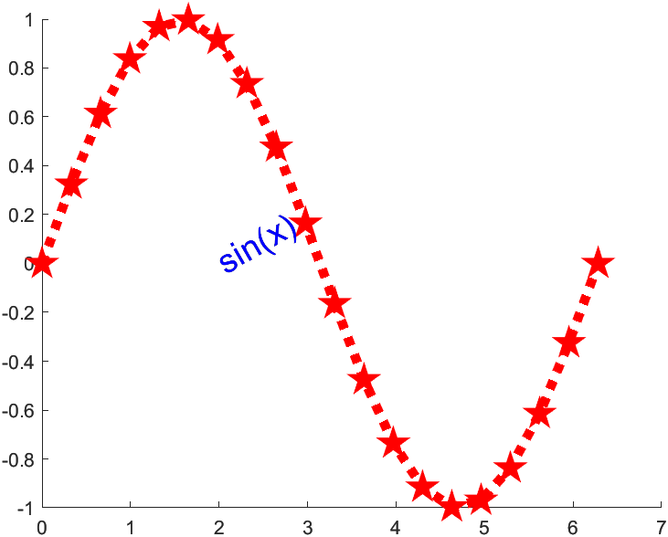

# Matlab Plot

- [Matlab Plot](#matlab-plot)
  - [simple plot](#simple-plot)
  - [plot decoration](#plot-decoration)
  - [axis](#axis)
  - [subplot](#subplot)
  - [plot advanced](#plot-advanced)
  - [handles](#handles)

## simple plot

```matlab
% x, y都是1xn矩阵

x=0:0.01:2*pi;
y=sin(x);
plot(x,y)
```

> 

```matlab
% x是1xn矩阵，y是mxn矩阵

x=0:0.01:2*pi;
y1=sin(x);
y2=cos(x);
y3=sin(2*x);
y=[y1;y2;y3];
plot(x,y)
```

> 

```matlab
% x是m1xn矩阵，y是m2xn矩阵；按照每一列对应的来画

x1=0:0.01:2*pi;
x2=-pi:0.01:pi;
x=[x1;x2]';

y1=sin(x1);
y2=cos(2*x2);
y=[y1;y2]';

plot(x,y)
legend('sin', 'cos')
```

> 

```matlab
% only one parameter

x=linspace(0, 2*pi, 100);
y=sin(x);
plot(y)
```

> 

```matlab
% 复数作为参数，相当于两个参数

x=linspace(0,2*pi,200);
y1=sin(x);
y2=cos(x);
y3=y1+i*y2;

plot(y3);
axis equal;
```

> 

```matlab
% hold on

clf; % clear figure

x=linspace(0,2*pi);
y1=sin(x);
y2=sin(x)./x;
hold on;
plot(x,y1);
plot(x,y2);
```

> 

## plot decoration

```matlab
x1=linspace(0,2*pi,200);
x2=linspace(0,2*pi,100);
x3=linspace(0,2*pi,50);
y1=sin(x1);
y2=cos(x2);
y3=sin(x3)./x3;
%r,g,b,y,m,k
%*.p<>- -- -. :
plot(x1,y1,'r*',x2,y2,'pb',x3,y3,'>g');
text(3,0.5,'sin(x)')
xlabel('x');
ylabel('y');
title('sin,cos,etc');

%legend
legend('sin(x)','sin(x)/x');

%LaTex
text(4,0.8,'x_2')
text(2,0.3,'$$\frac{sin(x)}{x}$$','Interpreter','latex');
```

> 

## axis

```matlab
x1=linspace(0,2*pi,200);
x2=linspace(0,2*pi,100);
x3=linspace(0,2*pi,50);
y1=sin(x1);
y2=cos(x2);
y3=sin(x3)./x3;
plot(x1,y1,'r*',x2,y2,'pb',x3,y3,'>g');
text(3,0.5,'sin(x)')
xlabel('x');
ylabel('y');

%legend
legend('sin(x)','sin(x)/x');

% xlim([0 8]);
% ylim([-1.5 1.5]);
% %or use the following method
axis([0,8,-1.5,1.5]);

% axis off;
% axis on;
% %axis auto会使得axis([0,8,-1.5,1.5]);失效
% axis auto;
% %axis square;会使得坐标轴变成正方形
% axis square;
axis equal;
```

> 

## subplot

```matlab
clf;clear;

x=linspace(0,2*pi);
y1=sin(x);
y2=sin(x)./x;
subplot(221),plot(x,y1);
subplot(224),plot(x,y2);
```

> 

## plot advanced

对象和句柄：MATLAB把构成图形的各个基本要素称为图形对象，产生每一个图形对象时，MATLAB会自动分配一个唯一的值用于表示这个对象，称为**句柄**。

对象间的基本关系：
- 计算机屏幕(最高级的对象，句柄值=0)→图形窗口→（用户菜单，用户控件，坐标轴）
- 坐标轴→（曲线，曲面，文字，图像，光源，区域，方框）

> `plot`绘制的图形属于高层的绘图，绘出的结果也是Line对象，通过set可以对Line对象的句柄行后期的修饰，get函数可以获取句柄(GUI)  
> 一般从底层绘图的方式是：**fig-axes-line, text….**

```matlab
clf;clear;

x=linspace(0,2*pi,20);
%handle of the line object
%产生line对象,h为line对象的句柄
%hl=line(x,sin(x));
%hp=plot(x,sin(x));
hl=line('XData',x,'YData',sin(x),'LineWidth',1,'LineStyle',...
    ':','Color','m');
set(hl,'LineWidth',5,'Color','r','Marker','p','MarkerSize',3);

ht=text(2,0,'sin');
set(ht,'color','b','string','sin(x)','fontsize',18,'rotation',30);

%这些对象都是计算机屏幕的子对象
%get,set灵活使用
```

> 

## handles

```matlab
% empty figure handle

clf;clear;

hf=figure;
get(gcf)
```

```matlab
% output
                 Alphamap: [1×64 double]
             BeingDeleted: 'off'
               BusyAction: 'queue'
            ButtonDownFcn: ''
                 Children: [0×0 GraphicsPlaceholder]
                 Clipping: 'on'
          CloseRequestFcn: 'closereq'
                    Color: [0.9400 0.9400 0.9400]
                 Colormap: [64×3 double]
                CreateFcn: ''
              CurrentAxes: [0×0 GraphicsPlaceholder]
         CurrentCharacter: ''
            CurrentObject: [0×0 GraphicsPlaceholder]
             CurrentPoint: [0 0]
                DeleteFcn: ''
             DockControls: 'on'
                 FileName: ''
        GraphicsSmoothing: 'on'
         HandleVisibility: 'on'
            InnerPosition: [520 378 560 420]
            IntegerHandle: 'on'
            Interruptible: 'on'
           InvertHardcopy: 'on'
              KeyPressFcn: ''
            KeyReleaseFcn: ''
                  MenuBar: 'none'
                     Name: ''
                 NextPlot: 'add'
                   Number: 2
              NumberTitle: 'on'
            OuterPosition: [512 370 576 459]
         PaperOrientation: 'portrait'
            PaperPosition: [1.3333 3.3125 5.8333 4.3750]
        PaperPositionMode: 'auto'
                PaperSize: [8.5000 11]
                PaperType: 'usletter'
               PaperUnits: 'inches'
                   Parent: [1×1 Root]
                  Pointer: 'arrow'
        PointerShapeCData: [16×16 double]
      PointerShapeHotSpot: [1 1]
                 Position: [520 378 560 420]
                 Renderer: 'opengl'
             RendererMode: 'auto'
                   Resize: 'on'
               Scrollable: 'off'
            SelectionType: 'normal'
           SizeChangedFcn: ''
                      Tag: ''
                  ToolBar: 'none'
                     Type: 'figure'
            UIContextMenu: [0×0 GraphicsPlaceholder]
                    Units: 'pixels'
                 UserData: []
                  Visible: 'off'
      WindowButtonDownFcn: ''
    WindowButtonMotionFcn: ''
        WindowButtonUpFcn: ''
        WindowKeyPressFcn: ''
      WindowKeyReleaseFcn: ''
     WindowScrollWheelFcn: ''
              WindowState: 'normal'
              WindowStyle: 'normal'
```

```matlab
% figure handle with axes handle
clf;clear;

hf=figure
ha=axes('Parent',hf,'Units','normalized','Position',[0.05 0.2 0.3 0.7],...
    'Box','on','GridLineStyle','-','XLim',[0 10],'YLim',[-10 20])
get(hf)
```

```matlab
% output
hf = 
  Figure (3) with properties:

      Number: 3
        Name: ''
       Color: [0.9400 0.9400 0.9400]
    Position: [520 378 560 420]
       Units: 'pixels'

  Show all properties


ha = 
  Axes with properties:

             XLim: [0 10]
             YLim: [-10 20]
           XScale: 'linear'
           YScale: 'linear'
    GridLineStyle: '-'
         Position: [0.0500 0.2000 0.3000 0.7000]
            Units: 'normalized'

  Show all properties

                 Alphamap: [1×64 double]
             BeingDeleted: 'off'
               BusyAction: 'queue'
            ButtonDownFcn: ''
                 Children: [1×1 Axes]
                 Clipping: 'on'
          CloseRequestFcn: 'closereq'
                    Color: [0.9400 0.9400 0.9400]
                 Colormap: [64×3 double]
                CreateFcn: ''
              CurrentAxes: [1×1 Axes]
         CurrentCharacter: ''
            CurrentObject: [0×0 GraphicsPlaceholder]
             CurrentPoint: [0 0]
                DeleteFcn: ''
             DockControls: 'on'
                 FileName: ''
        GraphicsSmoothing: 'on'
         HandleVisibility: 'on'
            InnerPosition: [520 378 560 420]
            IntegerHandle: 'on'
            Interruptible: 'on'
           InvertHardcopy: 'on'
              KeyPressFcn: ''
            KeyReleaseFcn: ''
                  MenuBar: 'none'
                     Name: ''
                 NextPlot: 'add'
                   Number: 3
              NumberTitle: 'on'
            OuterPosition: [512 370 576 459]
         PaperOrientation: 'portrait'
            PaperPosition: [1.3333 3.3125 5.8333 4.3750]
        PaperPositionMode: 'auto'
                PaperSize: [8.5000 11]
                PaperType: 'usletter'
               PaperUnits: 'inches'
                   Parent: [1×1 Root]
                  Pointer: 'arrow'
        PointerShapeCData: [16×16 double]
      PointerShapeHotSpot: [1 1]
                 Position: [520 378 560 420]
                 Renderer: 'opengl'
             RendererMode: 'auto'
                   Resize: 'on'
               Scrollable: 'off'
            SelectionType: 'normal'
           SizeChangedFcn: ''
                      Tag: ''
                  ToolBar: 'none'
                     Type: 'figure'
            UIContextMenu: [0×0 GraphicsPlaceholder]
                    Units: 'pixels'
                 UserData: []
                  Visible: 'off'
      WindowButtonDownFcn: ''
    WindowButtonMotionFcn: ''
        WindowButtonUpFcn: ''
        WindowKeyPressFcn: ''
      WindowKeyReleaseFcn: ''
     WindowScrollWheelFcn: ''
              WindowState: 'normal'
              WindowStyle: 'normal'
```