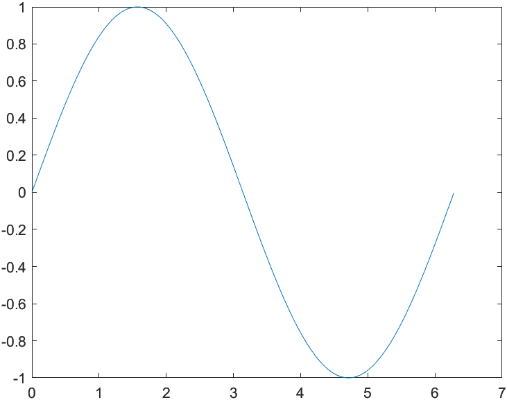
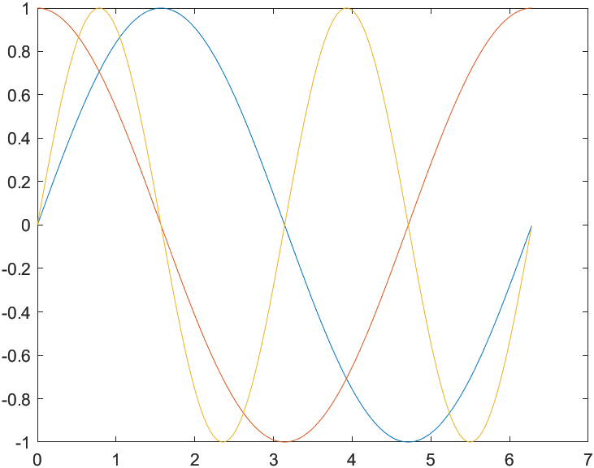
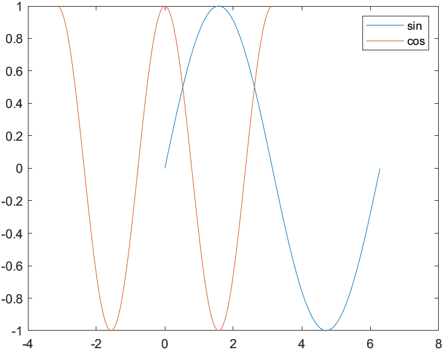
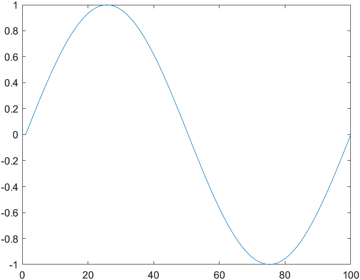
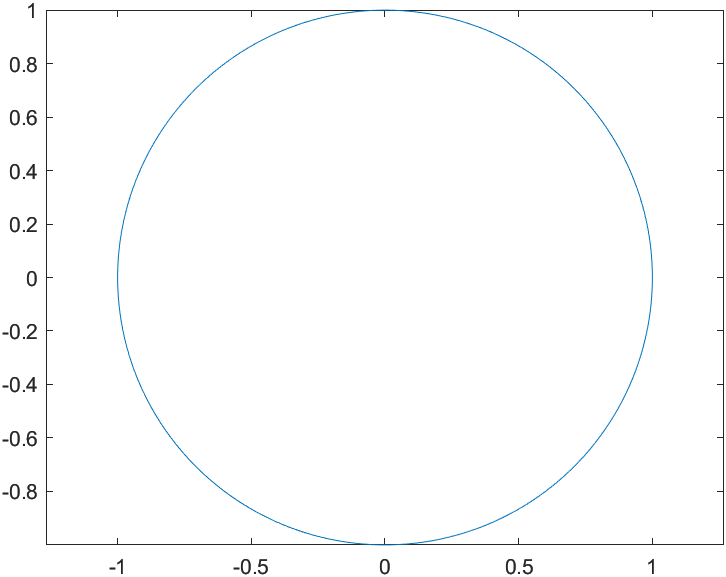

# Matlab Plot

- [Matlab Plot](#matlab-plot)
  - [simple plot](#simple-plot)

## simple plot

```matlab
% x, y都是1xn矩阵

x=0:0.01:2*pi;
y=sin(x);
plot(x,y)
```

> 

```matlab
% x是1xn矩阵，y是mxn矩阵

x=0:0.01:2*pi;
y1=sin(x);
y2=cos(x);
y3=sin(2*x);
y=[y1;y2;y3];
plot(x,y)
```

> 

```matlab
% x是m1xn矩阵，y是m2xn矩阵；按照每一列对应的来画

x1=0:0.01:2*pi;
x2=-pi:0.01:pi;
x=[x1;x2]';

y1=sin(x1);
y2=cos(2*x2);
y=[y1;y2]';

plot(x,y)
legend('sin', 'cos')
```

> 

```matlab
% only one parameter

x=linspace(0, 2*pi, 100);
y=sin(x);
plot(y)
```

> 

```matlab
% 复数作为参数，相当于两个参数

x=linspace(0,2*pi,200);
y1=sin(x);
y2=cos(x);
y3=y1+i*y2;

plot(y3);
axis equal;
```

> 