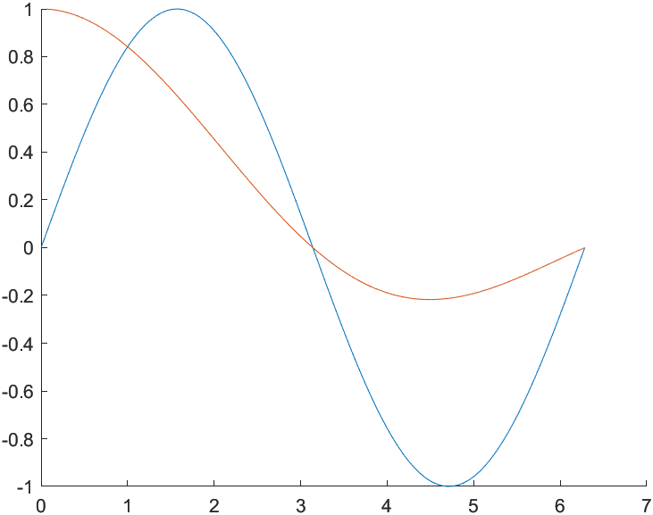
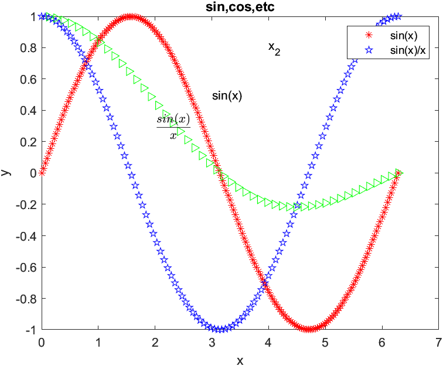
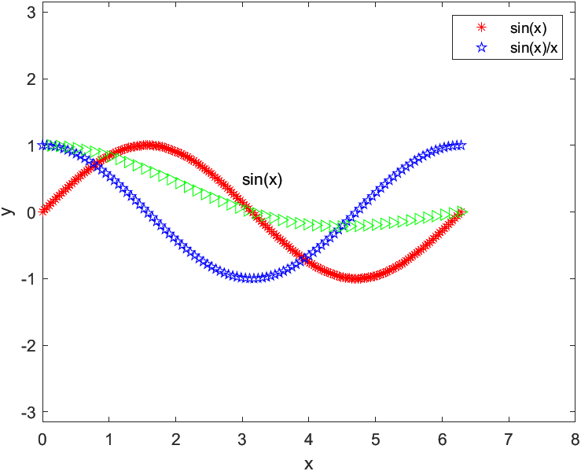
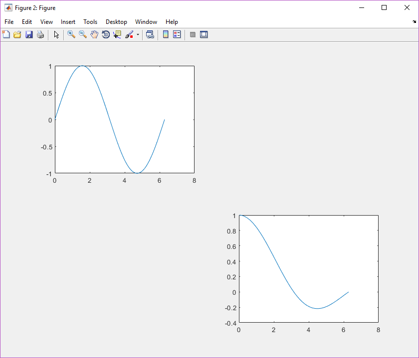

# Matlab Plot

- [Matlab Plot](#matlab-plot)
  - [simple plot](#simple-plot)
  - [plot decoration](#plot-decoration)
  - [axis](#axis)
  - [subplot](#subplot)

## simple plot

```matlab
% x, y都是1xn矩阵

x=0:0.01:2*pi;
y=sin(x);
plot(x,y)
```

> 

```matlab
% x是1xn矩阵，y是mxn矩阵

x=0:0.01:2*pi;
y1=sin(x);
y2=cos(x);
y3=sin(2*x);
y=[y1;y2;y3];
plot(x,y)
```

> 

```matlab
% x是m1xn矩阵，y是m2xn矩阵；按照每一列对应的来画

x1=0:0.01:2*pi;
x2=-pi:0.01:pi;
x=[x1;x2]';

y1=sin(x1);
y2=cos(2*x2);
y=[y1;y2]';

plot(x,y)
legend('sin', 'cos')
```

> 

```matlab
% only one parameter

x=linspace(0, 2*pi, 100);
y=sin(x);
plot(y)
```

> 

```matlab
% 复数作为参数，相当于两个参数

x=linspace(0,2*pi,200);
y1=sin(x);
y2=cos(x);
y3=y1+i*y2;

plot(y3);
axis equal;
```

> 

```matlab
% hold on

clf; % clear figure

x=linspace(0,2*pi);
y1=sin(x);
y2=sin(x)./x;
hold on;
plot(x,y1);
plot(x,y2);
```

> 

## plot decoration

```matlab
x1=linspace(0,2*pi,200);
x2=linspace(0,2*pi,100);
x3=linspace(0,2*pi,50);
y1=sin(x1);
y2=cos(x2);
y3=sin(x3)./x3;
%r,g,b,y,m,k
%*.p<>- -- -. :
plot(x1,y1,'r*',x2,y2,'pb',x3,y3,'>g');
text(3,0.5,'sin(x)')
xlabel('x');
ylabel('y');
title('sin,cos,etc');

%legend
legend('sin(x)','sin(x)/x');

%LaTex
text(4,0.8,'x_2')
text(2,0.3,'$$\frac{sin(x)}{x}$$','Interpreter','latex');
```

> 

## axis

```matlab
x1=linspace(0,2*pi,200);
x2=linspace(0,2*pi,100);
x3=linspace(0,2*pi,50);
y1=sin(x1);
y2=cos(x2);
y3=sin(x3)./x3;
plot(x1,y1,'r*',x2,y2,'pb',x3,y3,'>g');
text(3,0.5,'sin(x)')
xlabel('x');
ylabel('y');

%legend
legend('sin(x)','sin(x)/x');

% xlim([0 8]);
% ylim([-1.5 1.5]);
% %or use the following method
axis([0,8,-1.5,1.5]);

% axis off;
% axis on;
% %axis auto会使得axis([0,8,-1.5,1.5]);失效
% axis auto;
% %axis square;会使得坐标轴变成正方形
% axis square;
axis equal;
```

> 

## subplot

```matlab
clf;clear;

x=linspace(0,2*pi);
y1=sin(x);
y2=sin(x)./x;
subplot(221),plot(x,y1);
subplot(224),plot(x,y2);
```

> 