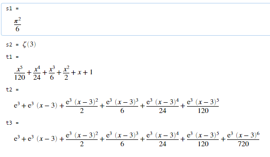
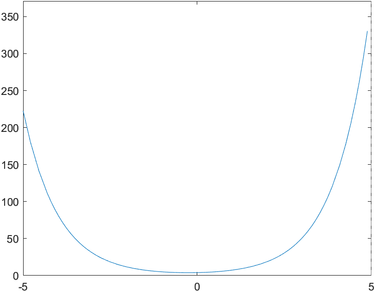
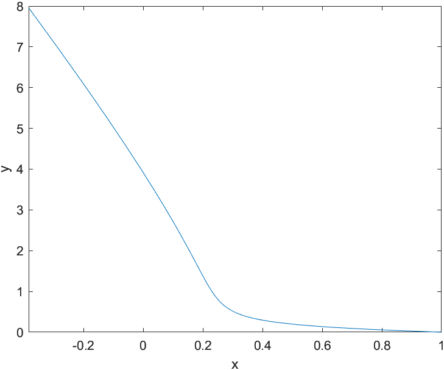
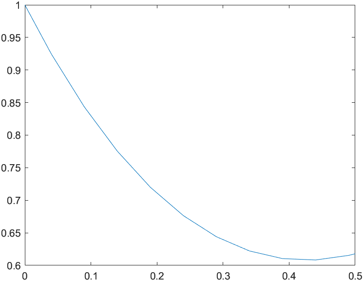

# Matlab Symbolic Math

- [Matlab Symbolic Math](#matlab-symbolic-math)
  - [symbolic express simplify](#symbolic-express-simplify)
  - [symbolic matrix](#symbolic-matrix)
  - [symbolic function](#symbolic-function)
  - [solve function](#solve-function)
  - [dsolve differential function](#dsolve-differential-function)
  - [partial differential equation](#partial-differential-equation)

MATLAB的符号计算慢，基于Symbolic Math toolbox, 内核是Maple

- 符号计算基础
  - 符号常量&符号变量
  - 符号四则运算
  - 符号表达式的化简
  - 符号矩阵运算
- 符号函数
  - Limit
  - Differentiate
  - Integrate
- 符号级数
- 符号方程求解
  - 代数方程
  - 微分方程

```matlab
%Symbolic Variable
a=sym('a')
cla=class(a)
syms b
clb=class(b)
%symbolic constant
c=sym('3.1415926')

whos

% output
a = a
cla = 'sym'
clb = 'sym'
c = 3.1415926

  Name      Size            Bytes  Class    Attributes

  a         1x1                 8  sym                
  b         1x1                 8  sym                
  c         1x1                 8  sym                
  cla       1x3                 6  char               
  clb       1x3                 6  char               
```

```matlab
% generate symbolic expression：三种方法

f1='3*x+6'
syms x
f2=3*x+4
f3=str2sym('3*y+4')
whos

% output
f1 = '3*x+6'
f2 = 3*x + 4
f3 = 3*y + 4
  Name      Size            Bytes  Class    Attributes

  f1        1x5                10  char               
  f2        1x1                 8  sym                
  f3        1x1                 8  sym                
  x         1x1                 8  sym                
```

Symbolic arithmetic: `+-*/^`

## symbolic express simplify

MATLAB [Simplification](https://www.mathworks.com/help/symbolic/simplification-1.html)

Symbolic expression and numeric convert: `sym` & `eval`

```matlab
% simplify使用多项式规则进行化简

syms x y;
simplify((1-x^2)/(1-x))

c=str2sym('3.1415926');
a=eval(c)

% output
ans=
    x+1

a = 3.1416
```

others:
- 因式分解: `factor`
- 展开: `expand`
- 合并同类项: `collect`

```matlab
syms a b x y;
f1=a^3-b^3
f2=factor(f1)

f3=(3*x^2+8*y^2)*(-x^2+3*y)
f4=expand(f3)

f5=3*x^2+4*x^2+5*x^2*y
f6=collect(f5)

% output
f1 =
    a^3 - b^3

f2 =
    [ a - b, a^2 + a*b + b^2]

f3 =
    (- x^2 + 3*y)*(3*x^2 + 8*y^2)

f4 =
    - 3*x^4 - 8*x^2*y^2 + 9*x^2*y + 24*y^3

f5 =
    5*x^2*y + 7*x^2

f6 =
    (5*y + 7)*x^2
```

## symbolic matrix

Notes:
- 构建方式与数值矩阵一致；
- 转置，determinant(判别式，行列式)：transpose(), det()
- 其他使用在数值矩阵的函数也可以用于符号矩阵

```matlab
syms x y;
A=[x,x+y;y,y^2]
B=A'
C=transpose(A)
D=det(A)

% output
A =
    [ x, x + y]
    [ y,   y^2]

B =
    [           conj(x),   conj(y)]
    [ conj(x) + conj(y), conj(y)^2]

C =
    [     x,   y]
    [ x + y, y^2]

D =
    x*y^2 - x*y - y^2
```

## symbolic function

- `subs`: 求解symbolic expression在给定变量下的数值
- `limit`
- `diff`
- `int`

```matlab
syms x;
f1=x^3-9;
a=subs(f1,3)

f2=sin(x)/x;
b=limit(f2,0)

f3=tan(x);
c=diff(f3)
d=diff(f3,2)
e=diff(f3,3)

f4=x;
f=int(f4)
g=int(f)
h=int(f4,0,4)
%上面的都是sym类型，需要eval
eval(h)

%   output
a =
    18

b =
    1

c =
    tan(x)^2 + 1

d =
    2*tan(x)*(tan(x)^2 + 1)

e =
    2*(tan(x)^2 + 1)^2 + 4*tan(x)^2*(tan(x)^2 + 1)

f =
    x^2/2

g =
    x^3/6

h =
    8

ans =
     8
```

other functions:
- `symsum`: 级数求和(sum of series)
- `taylor`： taylor expansion

```matlab
syms n;
f1=1/n^2;
s1=symsum(f1,n,1,inf)

f2=1/n^3;
s2=symsum(f2,n,1,inf)

syms x;
f4=exp(x);
t1=taylor(f4,x)
t2=taylor(f4,x,3)
%expansion to x^6
t3=taylor(f4,x,3,'Order',7)
```

> 

## solve function

```matlab
% 一元方程的数值解
syms x

% 1*x^2-2*x+1==0
eq1=1*x^2-2*x+1; % or 1*x^2-2*x+1==0
sol1=solve(eq1); % class is sym
eval(sol1)

% exp(x)==x+2
eq2=exp(x)-x-2;
sol2=solve(eq2);
eval(sol2)

% x^4 = 1
eq3=x^4-1;
sol3=solve(eq3);
eval(sol3)

% output
ans = 2×1    
     1
     1

ans = -1.8414
ans = 4×1 complex    
  -1.0000 + 0.0000i
   1.0000 + 0.0000i
   0.0000 - 1.0000i
   0.0000 + 1.0000i
```

```matlab
% 含有符号变量一元方程解 
syms x a b c
eq1=a*x^2+b*x+c;
solve(eq1, x)

% output
ans =
    -(b + sqrt(b^2 - 4*a*c))/(2*a)
    -(b - sqrt(b^2 - 4*a*c))/(2*a)
```

```matlab
% 含有符号变量一元方程解 

syms x a b c
a=sym('1');
b=sym('-2');
c=sym('1');
eq1=a*x^2+b*x+c;
sol=solve(eq1, x)
eval(sol)

% output
ans = 
    1
    1
```

$$
Ax=b;\\
A=\begin{bmatrix}
1&2&3\\
1&4&9\\
1&8&27
\end{bmatrix},
b=\begin{bmatrix}
5\\-2\\6
\end{bmatrix}
$$

```matlab
% 多元线性方程组, rank(A)=n
format rat
syms x y z
eq1= x+2*y+3*z-5;
eq2= x+4*y+9*z+2;
eq3= x+8*y+27*z-6;

sol=solve([eq1, eq2, eq3], [x, y, z]);
x1=eval(sol.x)
y1=eval(sol.y)
z1=eval(sol.z)

[x2, y2, z2]=solve([eq1, eq2, eq3], [x, y, z]);
eval([x2, y2, z2])

% output
x1 = 
      23       

y1 = 
     -29/2     

z1 = 
      11/3     

ans = 1×3    
      23            -29/2           11/3     
```

```matlab
% 多元线性方程组, rank(A)=n, by linsolve
format rat
A=[1,2,3;1,4,9;1,8,27]
b=[5;-2;6]

x=linsolve(A, b)

% output
x = 3×1    
      23       
     -29/2     
      11/3     
```


```matlab
% 多元线性方程组, rank(A)<n: 只能给出特解
syms x y z w
eq1= x+y-z-w-5;
eq2= 2*x-5*y+3*z+2*w+4;
eq3= 7*x-7*y+3*z+w-7;

[x2, y2, z2, w2]=solve([eq1, eq2, eq3], [x, y, z, w]);
eval([x2, y2, z2, w2])

% output
ans = 1×4    
     3     2     0     0
```

```matlab
% 多元线性方程组, rank(A)<n: linsolve只能给出特解
A=[1,1,-1,-1;2,-5,3,2;7,-7,3,1];
b=[5;-4;7];

[x, r]=linsolve(A, b)

% output
x = 4×1    
       3       
       2       
       0       
       0       

r = 
       2       
```

## dsolve differential function

[ODE solve](https://blog.csdn.net/EliminatedAcmer/article/details/80487859)

```matlab
% 解常微分方程

syms y(t);
Dy=diff(y, t);
D2y=diff(y, t, 2);
eq1 = t*D2y+3*Dy == 0;
ySol(t) = dsolve(eq1)

% output
ySol(t) = 
    C1 + C2/t^2
```

```matlab
% ode with condition
syms y(t); 
Dy = diff(y,t);
D2y=diff(y, t, 2);
eq1 = D2y-y;
cond = [y(0)==4, Dy(0)==1];
ySol(t) = dsolve(eq1,cond)
fplot(ySol);

% output
ySol(t) = 
    (3*exp(-t))/2 + (5*exp(t))/2
```

> 

$$
\left\{ \begin{array}{l}
	\frac{dx}{dt}+5x+y=e^t\\
	\frac{dy}{dt}-x-3y=0\\
\end{array} \right. ,\left\{ \begin{array}{l}
	x\left( 0 \right) =1\\
	y\left( 0 \right) =0
\end{array} \right. ,\\
$$

```matlab
% 解常微分方程组
syms x(t) y(t);
Dx=diff(x, t);
Dy=diff(y, t);

eq1=Dx+5*x+y-exp(t);
eq2=Dy-x-3*y;

cond=[x(0)==1, y(0)==0];
[x1(t),y1(t)]=dsolve([eq1, eq2], cond);
fplot(x1,y1,[0, 1.3]);
xlabel('x');
ylabel('y');
```

> 

$$
\left\{ \begin{array}{l}
	\frac{dy}{dt}-2t-2t^2+2y=0\\
	y\left( 0 \right) =1\\
\end{array} \right. 
$$

```matlab
% ODE 某范围近似解, by anonymous function
y0=1;
[t, y]=ode23(@(t, y) 2*t+2*t^2-2*y,[0 0.5], y0);
plot(t, y)
```

```matlab
% ODE 某范围近似解
[t, y]=ode23(@odefunc, [0 0.5], 1);
plot(t, y)

function dydt=odefunc(t, y)
  dydt=2*t+2*t^2-2*y;
end
```

> 

## partial differential equation

使用PDE Toolbox