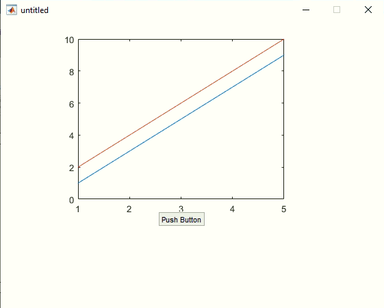

# Matlab IO

- [Matlab IO](#matlab-io)
  - [read ascii](#read-ascii)
  - [read excel](#read-excel)
  - [write ascii & write excel](#write-ascii--write-excel)

## read ascii

example: `load`

```bash
# data.txt
1 11
2 22
3 33
4 44
```

```matlab
data=load('data.txt')

% output
data = 4×2    
     1    11
     2    22
     3    33
     4    44
```

example: `fscanf`
> [io format Table](https://www.mathworks.com/help/matlab/ref/fscanf.html)

```bash
# data.txt load()无法读取，所以采用fscanf
1 11 111 1111
2 22
3 33
4 44
```

```matlab
clear;close all;

% open file
fid=fopen('data.txt','r');
% read
A=fscanf(fid, '%d')
% close file
fclose(fid);

% output
A = 10×1    
           1
          11
         111
        1111
           2
          22
           3
          33
           4
          44
```

example: `textscan`
> 读取多列

```bash
# data.txt
1 11 111 1111
2 22
3 33
4 44
```

```matlab
clear;close all;

% open file
fid=fopen('data.txt','r');
[A, pos1]=textscan(fid,'%d %d %d %d %d') % 故意设置5列
pos2=ftell(fid)
% close file
fclose(fid);

for i=1:5
    A{i}
end

% output
A = 
    {4×1 int32}    {4×1 int32}    {3×1 int32}    {3×1 int32}    {3×1 int32}

pos1 = 31
pos2 = 31
ans = 4×1 int32 column vector    
   1
   2
   3
   4

ans = 4×1 int32 column vector    
   11
   22
   33
   44

ans = 3×1 int32 column vector    
   111
     0
     0

ans = 3×1 int32 column vector    
   1111
      0
      0

ans = 3×1 int32 column vector    
   0
   0
   0
```

example: `textscan` remove headlines

```bash
# data.txt
This is headline1
This is headline2
1 11 111 1111
2 22
3 33
4 44
```

```matlab
clear;close all;

% open file
fid=fopen('data.txt','r');
A=textscan(fid,'%d %d %d %d %d', 'Headerlines', 2)
% close file
fclose(fid);
```

## read excel

```bash
# book.xlsx
1 2
3 4
5 6
7 8
9 10
```

```matlab
data=xlsread('book.xlsx', 'Sheet1')

% output
data = 5×2    
     1     2
     3     4
     5     6
     7     8
     9    10
```

example: guide read excel
> 

```matlab
% mygui.m

% --- Executes on button press in pushbutton1.
function pushbutton1_Callback(hObject, eventdata, handles)
% hObject    handle to pushbutton1 (see GCBO)
% eventdata  reserved - to be defined in a future version of MATLAB
% handles    structure with handles and user data (see GUIDATA)
data = xlsread('book.xlsx', 'Sheet1');
plot(handles.axes1, data);
```

## write ascii & write excel

```matlab
clear;close all;

fid=fopen('generated1.txt', 'w');
fprintf(fid, '%s', 'Hi, Grey');
fclose(fid);

fid=fopen('generated2.txt', 'w');
fprintf(fid, '%c\r\n', 'Hi, Grey');
fclose(fid);
```

```bash
# generated1.txt
Hi, Grey
```

```bash
# generated2.txt
H
i
,
 
G
r
e
y
```

example: write number

```matlab
clear;close all;

fid=fopen('gen_data.txt', 'w');
fprintf(fid, '%d', 1:10);
fclose(fid);
```

```bash
# gen_data.txt
12345678910
```

example: write excel

```matlab
xlswrite('gen_book.xlsx', randn(10, 1), 'B1:B10');
```

example: excel read & write

```matlab
%默认读取sheet全部数据
excel_data1=xlsread('book.xlsx')
excel_data2=xlsread('book.xlsx','sheet2','A1:A5')

%export matrix to Excel
matlab_data=[1:10;2:11];
%导出部分数据到excel,全部导出不需要'B5:E6'
xlswrite('book.xlsx',matlab_data,'sheet3','B5');
xlswrite('book.xlsx',matlab_data,'sheet3','B8:E9');

%xlsx information
[a,b,c]=xlsfinfo('book.xlsx')

whos

%output=======================================
excel_data1 = 
     1   NaN     1
   NaN     3     2
   NaN   NaN     3
   NaN   NaN     4
   NaN   NaN     5
   NaN   NaN     6
   NaN   NaN     7
   NaN   NaN     8
   NaN   NaN     9
   NaN   NaN    10

excel_data2 = 
     3
     6
     9
    12
    15

a = 'Microsoft Excel Spreadsheet'
b = 
    {'Sheet1'}    {'Sheet2'}    {'sheet3'}

c = 'xlOpenXMLWorkbook'
  Name              Size            Bytes  Class     Attributes

  a                 1x27               54  char
  b                 1x3               372  cell
  c                 1x17               34  char
  excel_data1      30x3               720  double
  excel_data2       5x1                40  double
  matlab_data       2x10              160  double
```