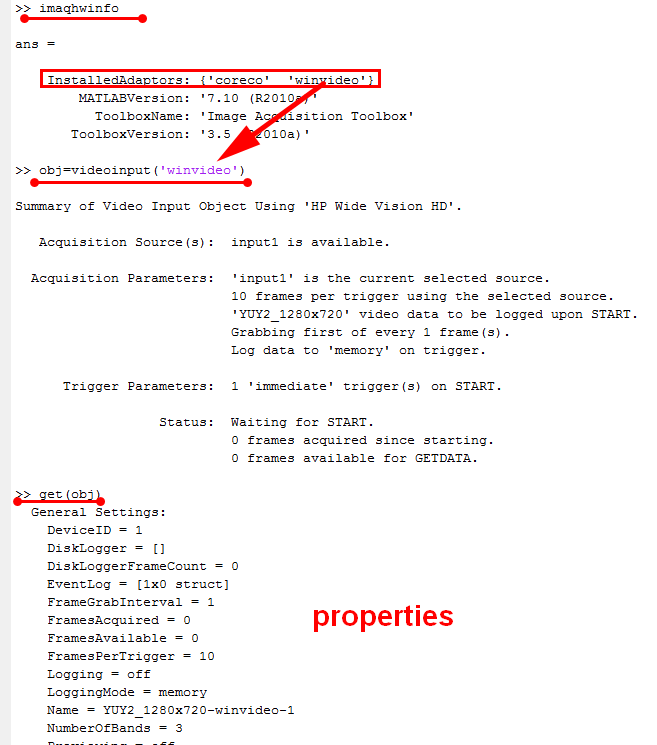
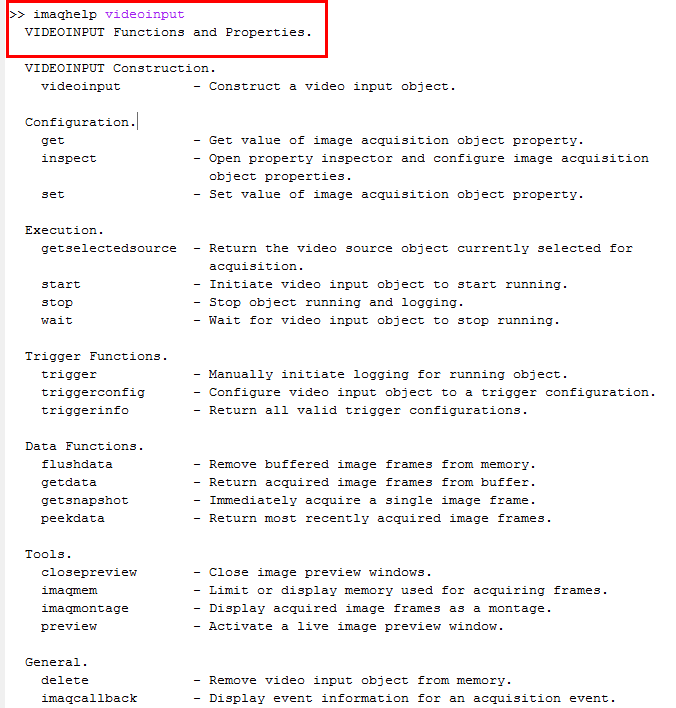
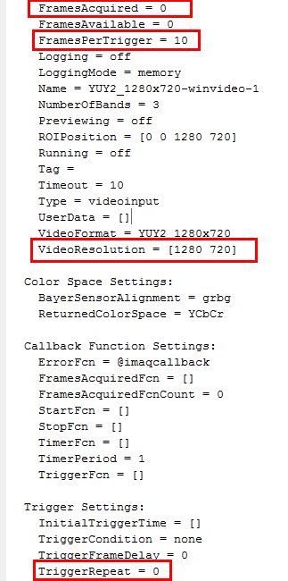
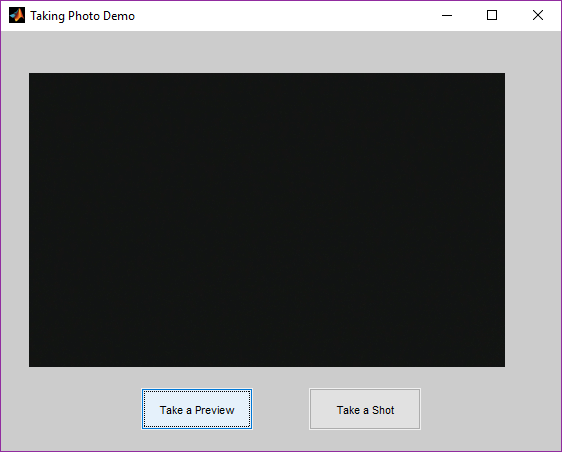
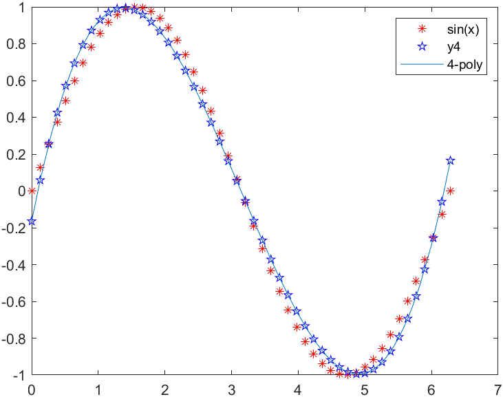
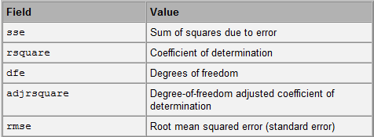
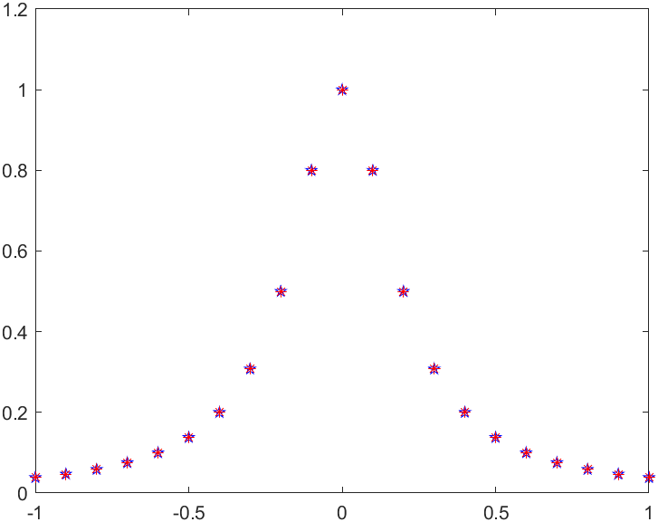

# Matlab Toolbox

- [Matlab Toolbox](#matlab-toolbox)
  - [Image Acquisition Toolbox](#image-acquisition-toolbox)
  - [poly & non-poly curve fitting](#poly--non-poly-curve-fitting)
    - [Polyfit](#polyfit)
    - [Curve Fit Toolbox](#curve-fit-toolbox)

## Image Acquisition Toolbox

编写照相和监控系统，用于图像获取处理和监控的仿真，虽然提供了GUI，但是要应用一般要包装好这些函数再调用
> 提供的GUI:Apps/Acquisition

常用属性和方法：
- 属性
  - FramesPerTrigger        - Number of frames to acquire for each trigger.
  - TriggerRepeat           - Number of additional times to repeat a trigger.
  - FramesAcquired          - Total number of frames acquired per source.
  - VideoResolution         - Vector indicating the image width and height for the incoming video signal.
  - NumberOfBands        -Indicate number of color bands in data to be acquired
- 方法
  - getsnapshot        - Immediately acquire a single image frame.
  - preview            - Activate a live image preview window.
  - closepreview       - Close image preview windows.
  - start              - Initiate video input object to start running.
  - stop               - Stop object running and logging. 

example: control webCam
> 算法思想：`Imaqhwinfo`获取硬件`adaptorname`；`obj=videoinput(adaptorname);`；obj为一个videoinput对象，和MATLAB提供的所有对象一样，具有完整的属性和函数，通过这些属性和函数的控制，可以完成用户需要的功能


  
>   
> `Imaqhelp videoinput`：获取videoinput所有对象的函数和属性  
>   
>   
> 

```matlab
clear; close all;

obj=videoinput('winvideo');
set(obj,'TriggerRepeat',inf,'FramesPerTrigger',1);
%preview(obj);

%GUI
hf=figure('units','normalized','menubar','none','NumberTitle','off','name','Taking Photo Demo');
ha=axes('Parent',hf,'Units','normalized','Position',[.05,.2,.85,.7]);
axis off;

%doc preview
hb1=uicontrol('parent',hf,'units','normalized','position',[.25,.05,.2,.1],'string','Take a Preview',...
    'callback',...
    ['vidRes=get(obj,''VideoResolution'');',...
    'nBands=get(obj,''NumberOfBands'');',...
    'hImage=image(zeros(vidRes(2),vidRes(1),nBands));',...
    'preview(obj,hImage);']);

hb2=uicontrol('parent',hf,'units','normalized','position',[.55,.05,.2,.1],'string','Take a shot',...
    'callback',...
    'imwrite(getsnapshot(obj),''im.jpg'')');
```

定时功能：可实现定时拍照，类似于监控，可以用相关监控实现的仿真和系统实现
- 函数：`stop`,`start`
- 属性:
  - `TimerFcn`: - Callback function to execute whenever a predefined period of time passes.
  - `TimerPeriod`: - Period of time between timer events.

主要技巧(可以通过videoinput obj单独实现，也可以videoinput obj&timer对象协作实现)
- 设置obj的定时周期timerperiod和定时回调函数(timerfcn);
  - timerfcn执行getsnapshot
- Start obj;
- 定时周期到，执行callback; 
- Stop obj退出系统;


## poly & non-poly curve fitting

Fiiting vs Interpolation
- 插值的过程，插值函数必须经过数据点；
- 拟合的过程，拟合函数”最优“的靠近数据点；
  - 拟合标准：原始数据向量与拟合数据向量之间的距离（范数 ）最小，采用误差平方和来度量，即最小二乘法。采用求极值的方法来确定误差平方和最小值时的拟合系数即可

### Polyfit

ployfit获取系数，polyval获取拟合函数某点的数据；
- 如果数据点的形状像可以正次幂展开的函数，polyfit(x,y,n), n越大，效果越好；
- 如果数据点的形状像可以负次幂展开的函数，polyfit(x,y,n), n越大，效果越差；

```matlab
x=linspace(0, 2*pi, 50);
y=sin(x);
%四次多项式拟合
p4=polyfit(x,y,4);
y4=polyval(p4,x);
%获取表达式
f1=poly2sym(p4);
plot(x,y,'*r',x,y4,'pb');
hold on;
fplot(f1, [0, 2*pi])
legend('sin(x)','y4', '4-poly');

% output
ans =

(3071035548155387*x^4)/73786976294838206464 + (6682717726347111*x^3)/72057594037927936 - (7897562919243327*x^2)/9007199254740992 + (4281905247778701*x)/2251799813685248 - 7190925723718309/36028797018963968
```

> 

### Curve Fit Toolbox

用于非多项式拟合
> 可以直接使用`cftool`, 或者cftool自带的函数`fitoptions`, `fittype`, `fit`

fitoptions:
- normalize: on, off
- exclude:0,1
  - excludedata()
- weights
- method


example: fittype
> 
> 

```matlab
%原始数据
x=-1:0.1:1;
y=1./(1+25*x.^2);

options=fitoptions('method','NonlinearLeastSquare');
%用3个参数去拟合a,b,c，规定范围
options.Lower=[-Inf,-Inf,-Inf];
options.Upper=[Inf,Inf,Inf];
%第一个参数是符号运算,n作为problem
type=fittype('a/(b+c*x^n)','problem','n','options',options);

[cfun, gof]=fit(x',y',type,'problem',2);

y_fit=feval(cfun,x);

plot(x,y,'pb',x,y_fit,'*r');
cfun
gof

% output===========================================
Warning: Start point not provided, choosing random start point.

cfun = 
     General model:
     cfun(x) = a/(b+c*x^n)
     Coefficients (with 95% confidence bounds):
       a =      0.1081  (-1162, 1162)
       b =      0.1081  (-1162, 1162)
       c =       2.704  (-2.907e+04, 2.907e+04)
     Problem parameters:
       n =           2
gof = 
           sse: 1.7661e-07
       rsquare: 1.0000
           dfe: 18
    adjrsquare: 1.0000
          rmse: 9.9053e-05
```
