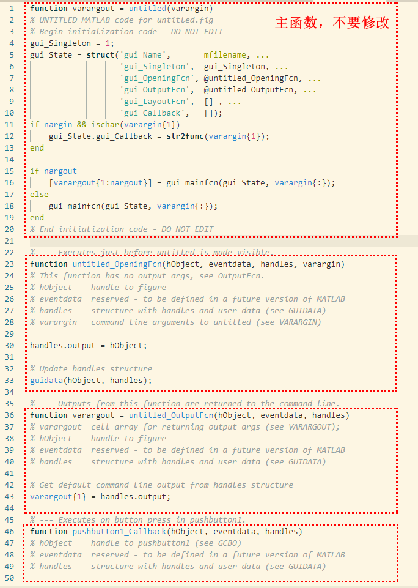

# MATLAB GUI Introduction

- [MATLAB GUI Introduction](#matlab-gui-introduction)
  - [how to write gui code](#how-to-write-gui-code)
  - [gui object](#gui-object)

## how to write gui code

GUI实现方式:
- 简单GUI用底层代码实现
- 复杂GUI用`guide`实现
- Matlab未来gui使用`appdesigner`

```bash
# in command window
guide

# working directory
untitled.m
untitled.fig
```

untitled.m分为4部分
- 主函数
- 打开函数(OpeningFcn)
- 输出函数(OutputFcn)
- 各种回掉函数(Callback)
> 

example: pushbutton1的text转移到pushbutton2

```matlab
% untitled.m只写了Callback部分
% --- Executes on button press in pushbutton1.
function pushbutton1_Callback(hObject, eventdata, handles)
set(handles.pushbutton2, 'string', get(handles.pushbutton1, 'string'));

% --- Executes on button press in pushbutton2.
function pushbutton2_Callback(hObject, eventdata, handles)
% hObject    handle to pushbutton2 (see GCBO)
% eventdata  reserved - to be defined in a future version of MATLAB
% handles    structure with handles and user data (see GUIDATA)
```

example: 临时生成pushbutton
> openningFcn加入临时pushbutton，界面的创立发生在openningFcn之前(已经建立了handles)，所以要用guidata更新handles

```matlab
% untitled.m 只写了OpeningFcn和Callcak函数部分
function untitled_OpeningFcn(hObject, eventdata, handles, varargin)
handles.output = hObject;

h=uicontrol('tag', 'tempBtn', 'string', 'newBtn', 'callback', {@tempBtn_Callback, handles});
handles.tempBtn=h;

% Update handles structure
guidata(hObject, handles);

% --- Executes on button press in pushbutton1.
function pushbutton1_Callback(hObject, eventdata, handles)
set(handles.tempBtn, 'string', 'from btn1')

function tempBtn_Callback(hObject, eventdata, handles)
set(handles.pushbutton1, 'string', 'from temp btn');
```

## gui object

object与handle一一对应
> 显示器是handle=0的对象

常用commands:
- `gcf`: get current figure handle;
- `gca`: get current axes handle;
- `gco`: get current object handler;
- `get`: 获得某obj的属性
- `set`: 设置某obj的属性
- `allchild`: 寻找某obj的子obj
- `findobj`: 寻找符合属性要求的obj

```matlab
gco
gcf % 新建一个figure
gca % 会新建一个figure和axes

% output
ans = 
  0×0 empty GraphicsPlaceholder array.

ans = 
  Figure (1) with properties:

      Number: 1
        Name: ''
       Color: [0.9400 0.9400 0.9400]
    Position: [520 378 560 420]
       Units: 'pixels'

  Show all properties


ans = 
  Axes with properties:

             XLim: [0 1]
             YLim: [0 1]
           XScale: 'linear'
           YScale: 'linear'
    GridLineStyle: '-'
         Position: [0.1300 0.1100 0.7750 0.8150]
            Units: 'normalized'

  Show all properties
```

example: demo `get`

```matlab
% in command window
>> plot(1:10);
>> h1=allchild(gcf)

h1 = 

  10×1 graphics array:

  Menu       (figMenuHelp)
  Menu       (figMenuWindow)
  Menu       (figMenuDesktop)
  Menu       (figMenuTools)
  Menu       (figMenuInsert)
  Menu       (figMenuView)
  Menu       (figMenuEdit)
  Menu       (figMenuFile)
  Toolbar    (FigureToolBar)
  Axes

>> get(h1(10)) % 其实就是h1的第10个元素: Axes; 其中最主要的属性就是Type

                       ALim: [0 1]
                   ALimMode: 'auto'
     ActivePositionProperty: 'outerposition'
                 AlphaScale: 'linear'
                   Alphamap: [1×64 double]
          AmbientLightColor: [1 1 1]
               BeingDeleted: 'off'
                        Box: 'on'
                   BoxStyle: 'back'
                 BusyAction: 'queue'
              ButtonDownFcn: ''
                       CLim: [0 1]
    ...................................
                       Type: 'axes'
              UIContextMenu: [0×0 GraphicsPlaceholder]
                      Units: 'normalized'
                   UserData: []
                       View: [0 90]
                    Visible: 'on'
                      XAxis: [1×1 NumericRuler]
              XAxisLocation: 'bottom'
                     XColor: [0.1500 0.1500 0.1500]
                 XColorMode: 'auto'
    ...................................
             ZTickLabelMode: 'auto'
         ZTickLabelRotation: 0
                  ZTickMode: 'auto'
```

example: new api
> [Graphical Ojbect](https://www.mathworks.com/help/matlab/creating_plots/graphics-objects.html)

```matlab
plot(rand(5))
ax=gca;
ax.Children

% output
ans = 
  5×1 Line array:

  Line
  Line
  Line
  Line
  Line
```

example: demo `set`

```matlab
>> set(h1(10), 'position', [0.5 0.5 0.2 0.4])
>> h2=allchild(gca)

h2 = 

  Line with properties:

              Color: [0 0.4470 0.7410]
          LineStyle: '-'
          LineWidth: 0.5000
             Marker: 'none'
         MarkerSize: 6
    MarkerFaceColor: 'none'
              XData: [1 2 3 4 5 6 7 8 9 10]
              YData: [1 2 3 4 5 6 7 8 9 10]
              ZData: [1×0 double]

  Show all properties

>> findobj(gcf, 'Type', 'Axes')

ans = 

  Axes with properties:

             XLim: [0 10]
             YLim: [0 10]
           XScale: 'linear'
           YScale: 'linear'
    GridLineStyle: '-'
         Position: [0.5000 0.5000 0.2000 0.4000]
            Units: 'normalized'

  Show all properties
```

example: Change the line color every second

```matlab
clear;close all;

h=figure('units','normalized','position',[.2 .2 .5 .5],'menu','none');
ha=axes('parent',h);
hl=line('parent',ha,'xdata',[0:.01:2*pi],'ydata',sin([0:.01:2*pi]),...
    'color','r');

colorString='rgbmky';
for k=1:6
    set(hl,'color',colorString(k));
    pause(1);
end
```