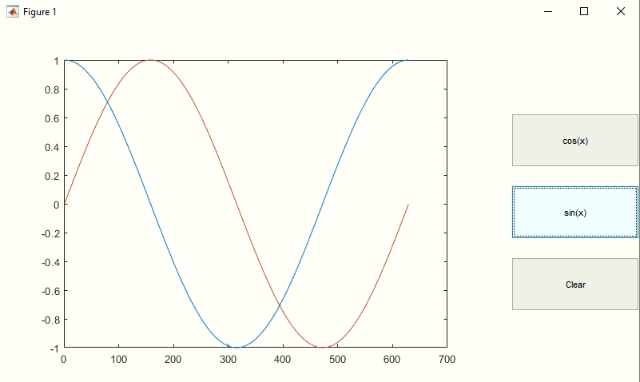

# Matlab GUI without GUIDE

- [Matlab GUI without GUIDE](#matlab-gui-without-guide)
  - [Introduction](#introduction)
  - [Callback](#callback)
  - [Dialogs](#dialogs)

## Introduction

GUI的底层代码实现：适合小程序;

example: 画三角函数
> 

```matlab
close all;clear;

h=figure('units','normalized','position',[.2 .2 .5 .5],'menu','none',...
    'color','w');
ha=axes('parent',h,'position',[.1 .1 .6 .8],'nextplot','add','box','on');
hb1=uicontrol('parent',h,'style','pushbutton','units','normalized','position',[.8 .2 .2 .15],...
    'string','Clear','callback','try delete (allchild(ha)); end');
hb2=uicontrol('parent',h,'style','pushbutton','units','normalized','position',[.8 .4 .2 .15],...
    'string','sin(x)','callback','plot(sin(0:.01:2*pi))');
hb3=uicontrol('parent',h,'style','pushbutton','units','normalized','position',[.8 .6 .2 .15],...
    'string','cos(x)','callback','plot(cos(0:.01:2*pi))');
```

some ui objects:
> [Graphical Objects](https://www.mathworks.com/help/matlab/graphics-object-properties.html)  
- Figure: `>> figure`
- Axes: `>> axes`
- Line
- Text
- uicontrols
- ...
> 

```matlab
% get object
hl=plot(1:10); % line handle
get(hl) % 可以显示hl中的所有属性
```

```matlab
hl=fplot('exp(x)');
x=get(hl,'xdata'); % 获取hl对象中的部分属性， 然后重绘
y=get(hl, 'ydata');
plot(x, y, 'r')
```

example: Text properties: `String= Hello`, `Interpreter=tex`
> 

```matlab
ht1=text(1,1,'Hello');
get(ht1) % 关注属性: String, Interpreter
ht2=text('string','int_0^x dF(x)','position',[.5 .5]);
ht3=text('interpreter','latex','string','$$\int_0^x dF(x)$$','position',[.2 .2]);
```

[uicontrol](https://www.mathworks.com/help/matlab/ref/uicontrol.html): 按照`Style`属性来区分不同的控件: `pushbutton`, `checkbox`, `slider`...

## Callback

Callback函数写法：
- method1: 用单引号`''`包裹函数体， 如果函数体中已经有单引号要转换为双引号
- method2: 无参: `@callback_func`; 含参: `{@callback_func, arg}`

```matlab
% method1 callback
b = uicontrol('Style','pushbutton','Callback','disp(666)');
```

```matlab
% method2 callback
b = uicontrol('Style','pushbutton','Callback',{@pushbutton_callback,666});

function pushbutton_callback(src,event,x)
   disp(x);
end
```

## Dialogs

example: open file dialog
> 只是提供filename, 并没有操作文件

```bash
# data.txt
1 2 3
2 3 4
```

```matlab
[a,b,c]=uigetfile('*.txt','This is a Title')

if (c==1)
    load(fullfile(b,a))
end

% output
a =
    'data.txt'

b =
    'C:\Users\Administrator\Documents\MATLAB\'

c =
     1

data =
     1     2     3
     2     3     4
```

example: save file dialog
> 只是提供filename, 并没有操作文件

```matlab
data=ones(3, 4);
[file, path]=uiputfile('*.txt')

if file~=0
    filename=fullfile(path, file)
    writematrix(data, filename); 
end

% output
file = 'hello.txt'
path = 'C:\Users\Administrator\Desktop\'
filename = 'C:\Users\Administrator\Desktop\hello.txt'
```

example: color picker dialog

```matlab
c=uisetcolor

% output
c = 
    1 0 0
```

example: color picker for plot

```matlab
hl=fplot('sin');
uisetcolor(hl);
```

```matlab
b=uicontrol('parent',gcf,'string','Set my color','style','pushbutton','callback',...
    'c=uisetcolor; set(b,''background'',c)');
```

example: font dialog

```matlab
figure;
b1=uicontrol('parent',gcf,'string','Set my fontsize','style','pushbutton','callback',...
    'c1=uisetfont; set(b1,''fontsize'',c1.FontSize)','units','normalized','position',[.8 .4 .2 .15]);
b2=uicontrol('parent',gcf,'string','Set my fontsize','style','pushbutton','callback',...
    'uisetfont(b2)','units','normalized','position',[.8 .6 .2 .15]);
```

example: progress bar

```matlab
h = waitbar(0,'Please wait...');
steps = 1000;
for step = 1:steps
    pause(0.001)
    waitbar(step / steps)
end
close(h) 
```

example: dialog with button

```matlab
h=dialog('name','input','position',[500 500 500 500]);
uicontrol('parent',h,'style','pushbutton','position',[80 10 100 50],'string','OK',...
    'callback','closereq');
```

Other dialogs:
- errordlg
- warndlg
- inputdlg: 输入框
- uigetdir: window 目录
- listdlg: 列表框