# Matlab GUIDE

- [Matlab GUIDE](#matlab-guide)
  - [Introduction](#introduction)
  - [Data Share](#data-share)
    - [same window](#same-window)
    - [different window](#different-window)

## Introduction

example: 画三角函数
> properite inspector中设置axes的`nextplot`属性为`add`  
> 

```matlab
% 忽略了其他函数， 之考虑OpeningFcn 和各种 Callback
function untitled1_OpeningFcn(hObject, eventdata, handles, varargin)
handles.output = hObject;

handles.x=-pi:0.01:pi;

% Update handles structure
guidata(hObject, handles);

function sin_Callback(hObject, eventdata, handles)
x=handles.x;
y=sin(x);
plot(handles.axes1,x,y,'b');

function cos_Callback(hObject, eventdata, handles)
x=handles.x;
y=cos(x);
plot(handles.axes1,x,y,'g');

function tan_Callback(hObject, eventdata, handles)
x=handles.x;
y=0.005*tan(x);
plot(handles.axes1,x,y,'r');

function clear_Callback(hObject, eventdata, handles)
delete(allchild(handles.axes1));
```

example: 菜单栏控制两种绘图模式
> 

```matlab
% --- Executes on button press in imageshow.
function imageshow_Callback(hObject, eventdata, handles)
axis(handles.axes2);
imshow('pout.tif');

% --- Executes on button press in clear.
function clear_Callback(hObject, eventdata, handles)
try
    delete(allchild(handles.axes1));
end

% --- Executes on button press in sin.
function sin_Callback(hObject, eventdata, handles)
ezplot(handles.axes1,'sin(x)');

% --------------------------------------------------------------------
function menu1_Callback(hObject, eventdata, handles)
h2=[handles.axes2 handles.imageshow];
set(h2,'visible','off');
h1=[handles.axes1 handles.sin handles.clear];
set(h1,'visible','on');
try
    delete(allchild(handles.axes2));
end

% --------------------------------------------------------------------
function menu2_Callback(hObject, eventdata, handles)
h2=[handles.axes2 handles.imageshow];
set(h2,'visible','on');
h1=[handles.axes1 handles.sin handles.clear];
set(h1,'visible','off');
try
    delete(allchild(handles.axes1));
end
```

example: gui with context menu
> step1: 设置menuEditor  
> step2: 设置properties inspector中的`UIContextMenu`为对应值

```matlab
figure('Menubar','none');
h=uicontextmenu;
uimenu(h,'label','context1');
uimenu(h,'label','context2');
set(gcf,'uicontextmenu',h);
```

Other gui related:
- gui with keyboard
- gui with mouse
- gui wth timer

## Data Share

### same window

同一个窗口，不同control之间数据共享
1. Global variables
    - 不同函数之间传递
2. UserData属性，有数量限制
    - 每一个控件有一个UserData属性，用于少数变量共享
3. AppData
    - Application defined Data
4. GUI Data
    - 可以实现控件的句柄以及不同的控件访问同一个变量的一致性访问，即都通过handles结构体来访问数据，handles.tag就是tag对应控件的句柄

example: global variable share, `global`
> 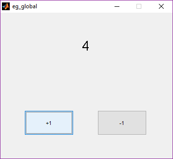  
> 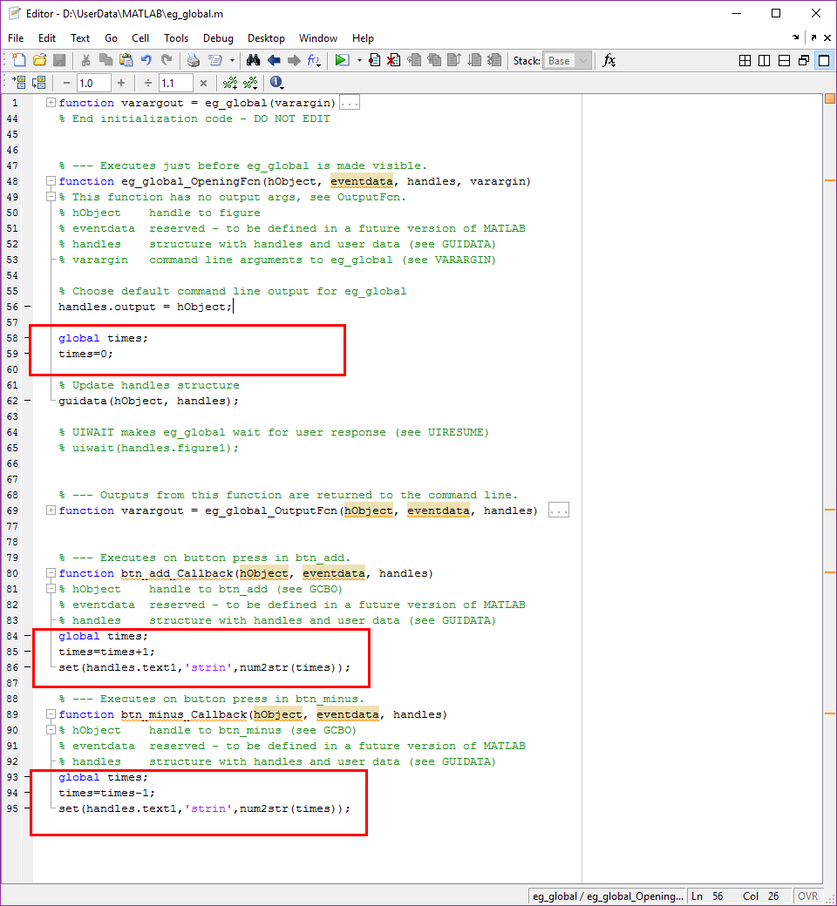  

example: userdata share, `get` & `set`
> 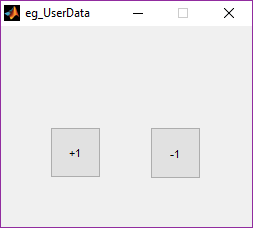  
> 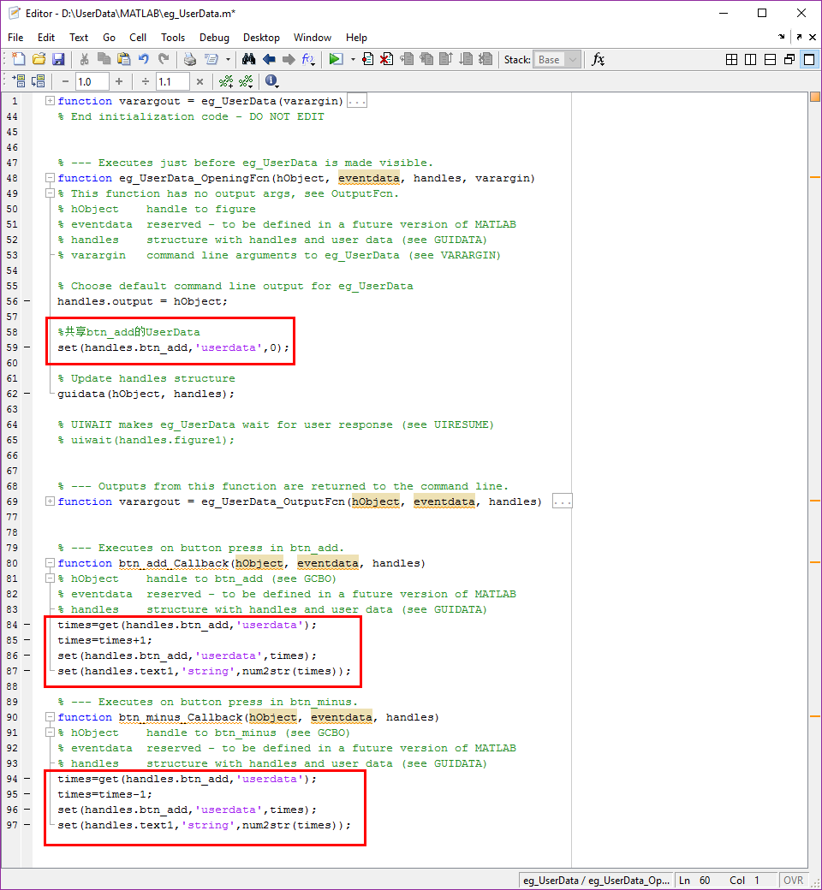  

example: appdata share, `getappdata` & `setappdata`
> appdata与某一个对象(句柄)相关联，setapp和getapp都有一个输入参数是句柄  
> 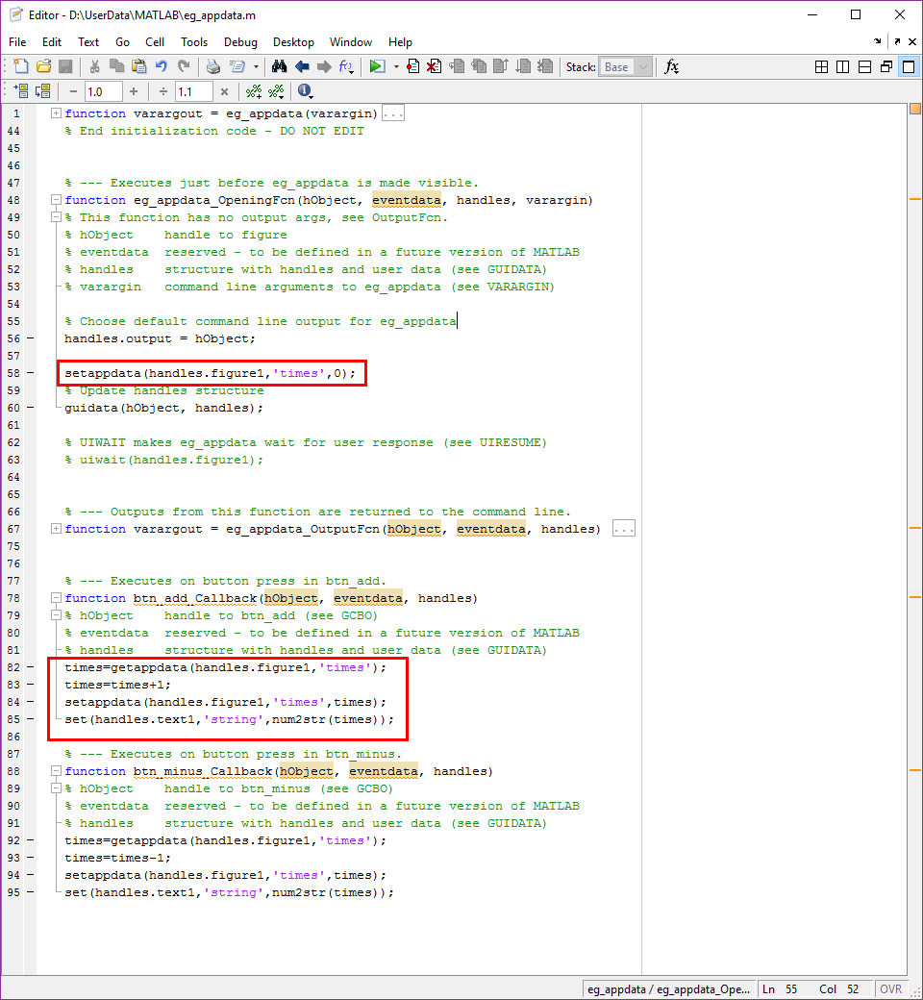

example: guidata share, `handles`, 修改之后需要更新
> 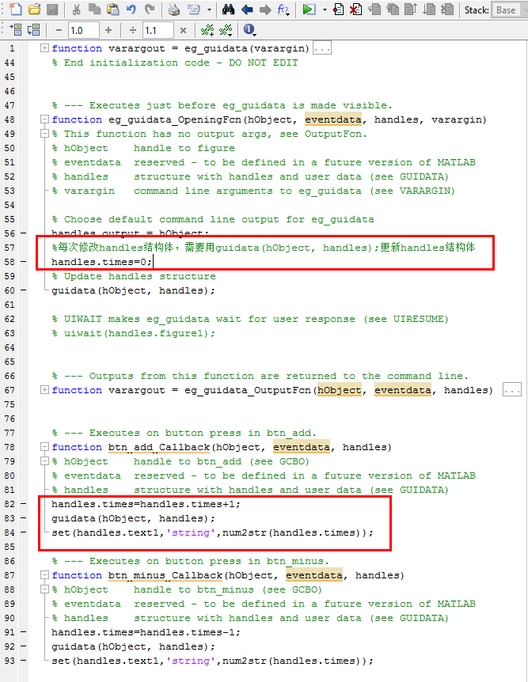

### different window

不同窗口数据共享:
1. 通过guihandles获得某一个窗口的handles结构体实现数据访问
2. 有输出参数的多窗口编程

example: 通过guihandles
> 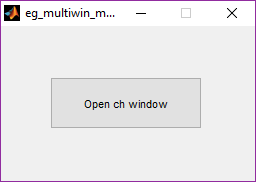
> 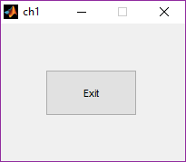  
> 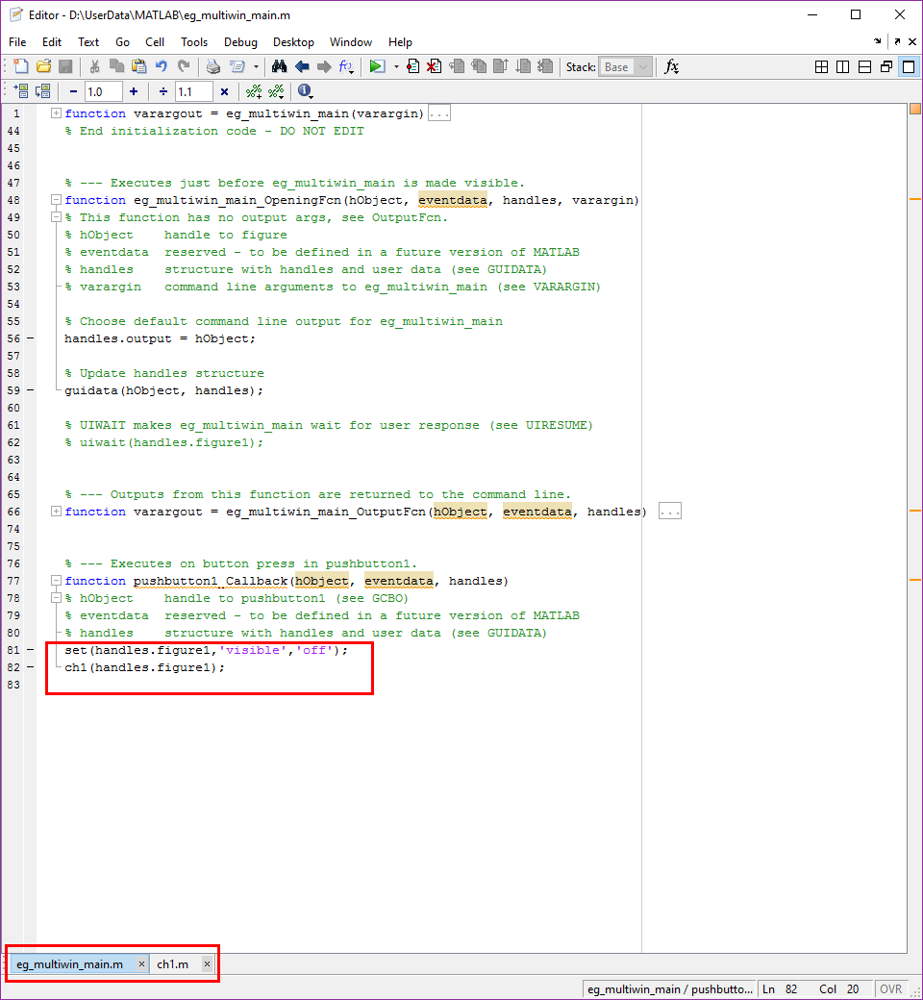  
> 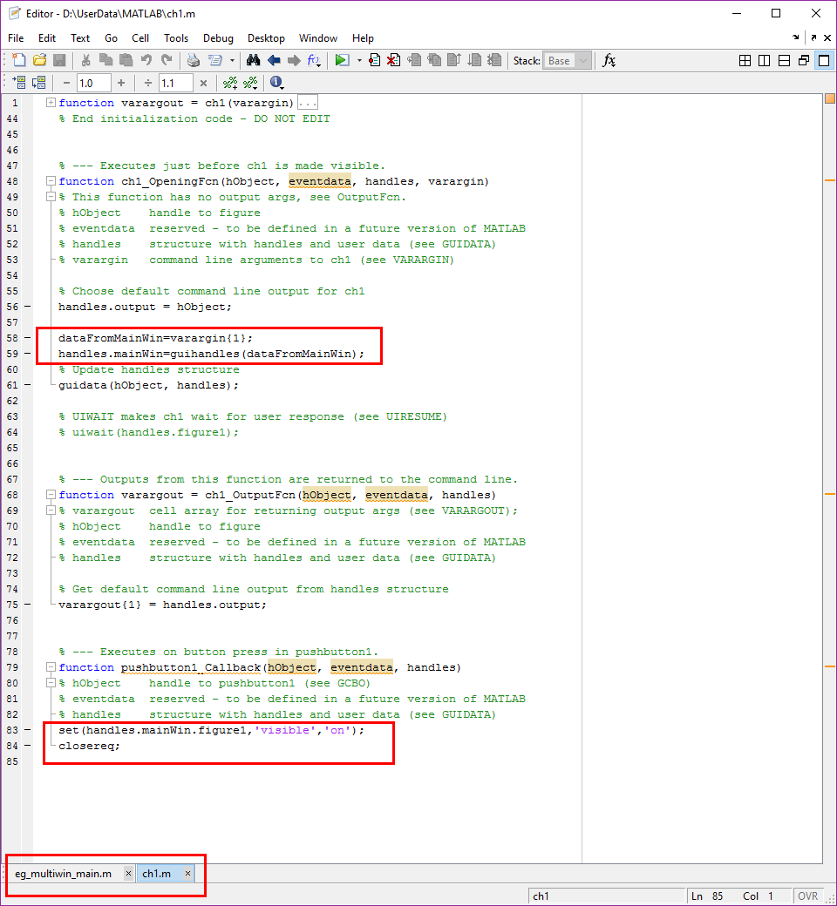  

example: 通过输出, `uiwait` & `uiresume`
> GUI执行顺序：主函数→OpenningFcn→OutputFcn→用户的函数(各种控件)，所以OutputFcn发生在用户函数之前；  
> 所以要有窗口的输出，修改执行过程为：主函数→OpenningFcn→等待用户输入→各种控件操作→OutputFcn；
> 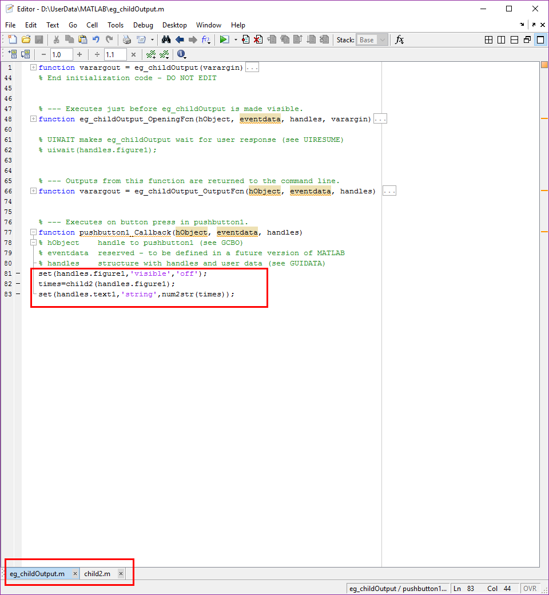  
> 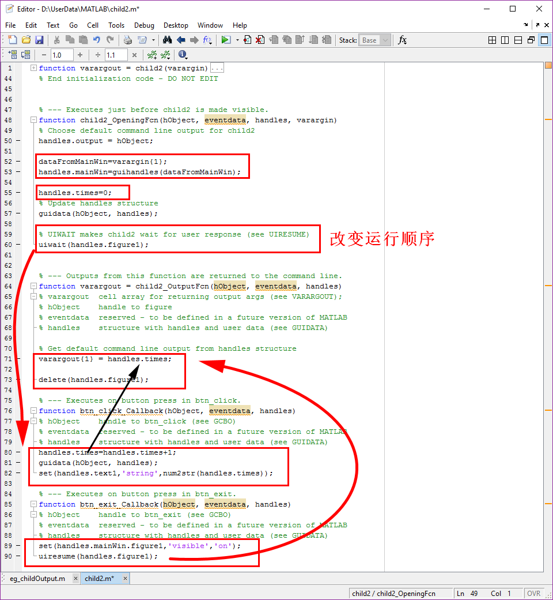  