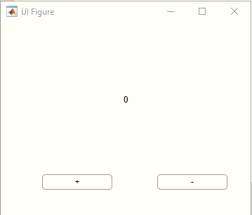

# Matlab Designer

[Differentce between GUIDE & AppDesigner](https://www.mathworks.com/help/matlab/creating_guis/differences-between-app-designer-and-guide.html)


example: [share data](https://www.mathworks.com/help/matlab/creating_guis/share-data-across-callbacks-in-app-designer.html)
> step1: 菜单栏Editor/Private Property/ 增加一个property  
> step2: 通过`app.`来共享数据  
> 

```matlab
classdef app1 < matlab.apps.AppBase
    % Properties that correspond to app components
    properties (Access = public)
        UIFigure  matlab.ui.Figure
        Button    matlab.ui.control.Button
        Button_2  matlab.ui.control.Button
        Label     matlab.ui.control.Label
    end
    
    properties (Access = private)
        % 自定义的app内部共享的属性(private)
        times=0; 
    end
    

    % Callbacks that handle component events
    methods (Access = private)

        % Button pushed function: Button
        function ButtonPushed(app, event)
            app.times=app.times+1;
            app.Label.Text=num2str(app.times);
        end

        % Button pushed function: Button_2
        function Button_2Pushed(app, event)
            app.times=app.times-1;
            app.Label.Text=num2str(app.times);
        end
    end

% ====================below is not important======================

    % Component initialization
    methods (Access = private)

        % Create UIFigure and components
        function createComponents(app)

            % Create UIFigure and hide until all components are created
            app.UIFigure = uifigure('Visible', 'off');
            app.UIFigure.Position = [100 100 356 274];
            app.UIFigure.Name = 'UI Figure';

            % Create Button
            app.Button = uibutton(app.UIFigure, 'push');
            app.Button.ButtonPushedFcn = createCallbackFcn(app, @ButtonPushed, true);
            app.Button.Position = [60 37 100 22];
            app.Button.Text = '+';

            % Create Button_2
            app.Button_2 = uibutton(app.UIFigure, 'push');
            app.Button_2.ButtonPushedFcn = createCallbackFcn(app, @Button_2Pushed, true);
            app.Button_2.Position = [224 37 100 22];
            app.Button_2.Text = '-';

            % Create Label
            app.Label = uilabel(app.UIFigure);
            app.Label.HorizontalAlignment = 'center';
            app.Label.Position = [128 128 102 74];
            app.Label.Text = '0';

            % Show the figure after all components are created
            app.UIFigure.Visible = 'on';
        end
    end

    % App creation and deletion
    methods (Access = public)

        % Construct app
        function app = app1

            % Create UIFigure and components
            createComponents(app)

            % Register the app with App Designer
            registerApp(app, app.UIFigure)

            if nargout == 0
                clear app
            end
        end

        % Code that executes before app deletion
        function delete(app)

            % Delete UIFigure when app is deleted
            delete(app.UIFigure)
        end
    end
end
```